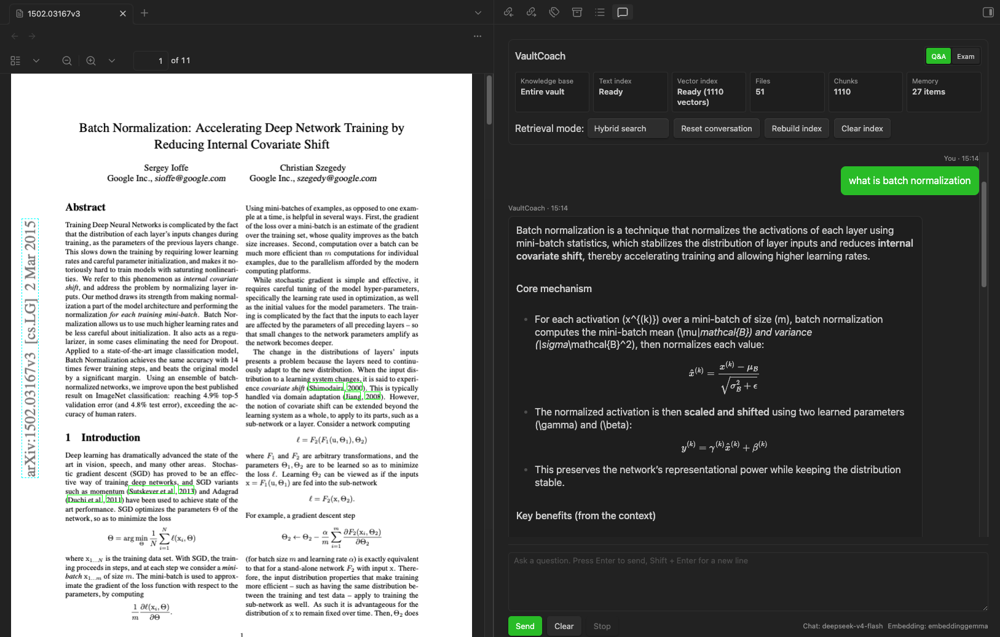
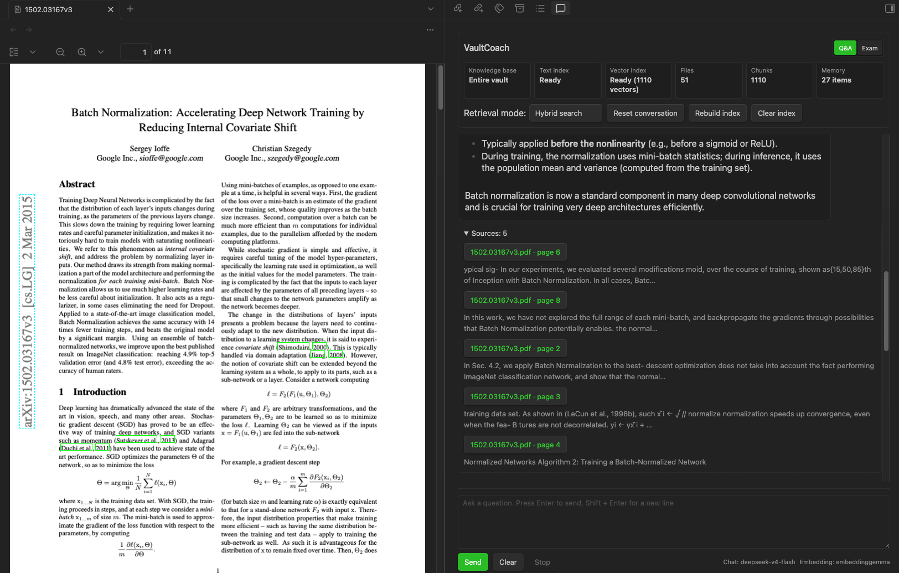
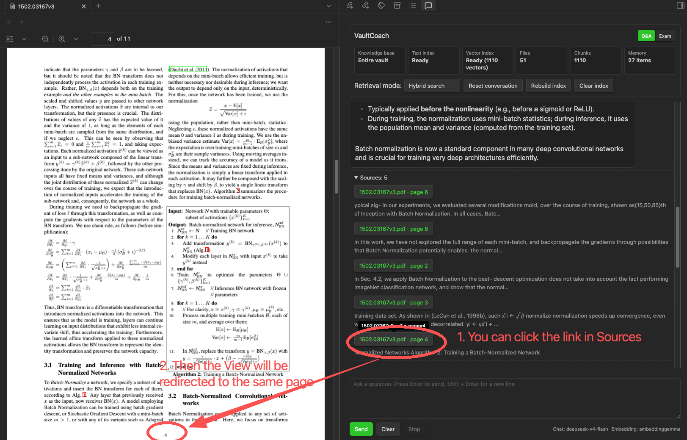
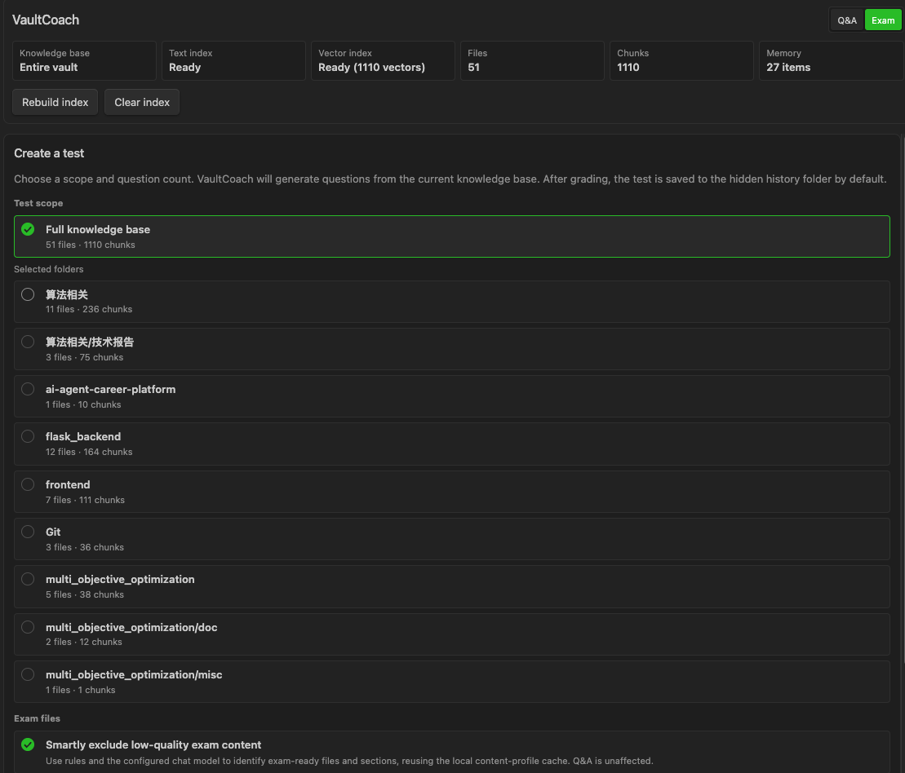
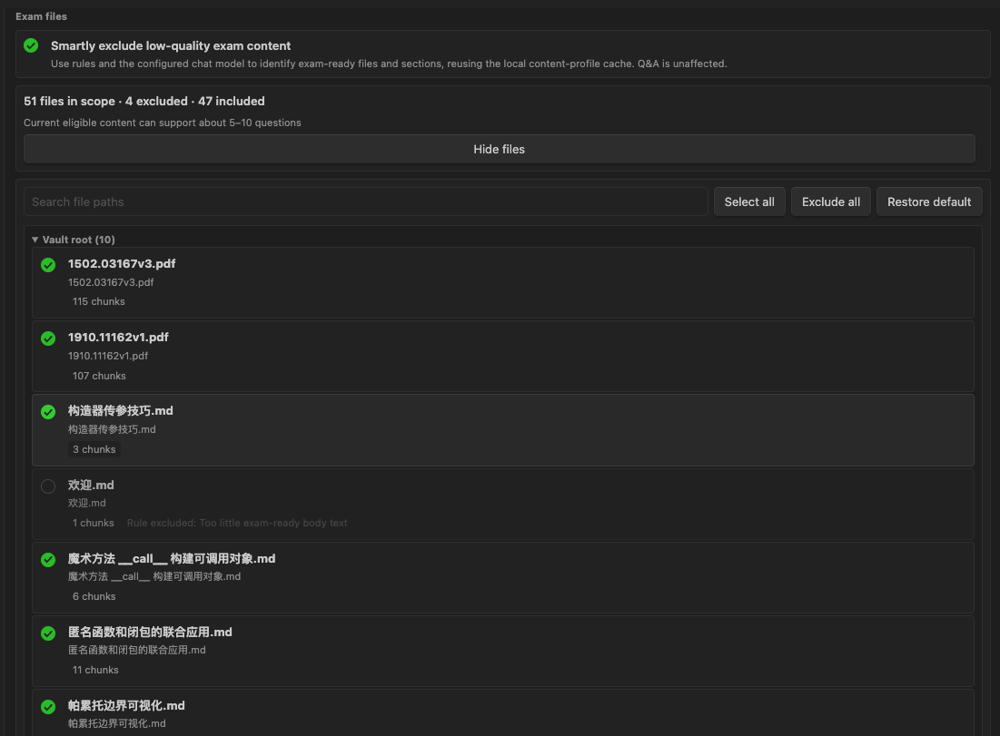

# Vault Coach

> Language: English | [中文](./README_CN.md)

Vault Coach turns your Obsidian vault into a local-first study and research assistant. Ask questions across Markdown notes and text-based PDFs, inspect cited sources, and generate exams from your own knowledge base.

It is designed for people who want a practical RAG workflow inside Obsidian without sending vault content to a remote service by default. Local [Ollama](https://ollama.com) is the default model provider, and OpenAI-compatible services can be configured explicitly when you need them.


[](./LICENSE)



## Why Vault Coach

Vault Coach is built for repeated learning and research workflows, not just one-off chat.

- **Ask your vault**: retrieve relevant Markdown notes and text-based PDF pages before answering.
- **Trust the answer**: every answer can show clickable sources, excerpts, headings, and PDF page references.
- **Study from your notes**: Exam mode turns selected folders and files into generated practice tests.
- **Stay local by default**: Ollama is the default for chat and embeddings.
- **Scale beyond Markdown**: text-based PDFs can be parsed, chunked, embedded, searched, and cited.
- **Use the model stack you prefer**: local Ollama or explicit OpenAI-compatible chat and embedding providers.
- **Use it in English or Chinese**: the plugin UI and documentation are available in both languages.

## Highlights

### Knowledge Q&A

Ask natural-language questions from the Vault Coach sidebar. The plugin retrieves relevant chunks, optionally rewrites the query, reranks candidates, and streams an answer with sources.

Supported retrieval modes:

- Keyword search
- Vector search
- Hybrid keyword/vector search
- Optional rerank endpoint with local heuristic fallback



### Text-Based PDF Support

Vault Coach can index native-text PDFs inside your vault. PDF text is extracted with page information, converted into searchable chunks, and shown as page-level sources in answers.

What works today:

- Text-layer PDF extraction
- PDF page count and file size limits
- Page-aware source links, such as `paper.pdf · page 3`
- PDF chunks in keyword, vector, hybrid, rerank, Q&A, and Exam mode
- Basic cleanup for repeated headers, footers, page numbers, and reading order
- Obsidian/KaTeX-compatible inline and block math normalization for model answers when formulas are produced from PDF content

Current limits:

- Scanned PDFs are detected as low-text/likely scanned, but OCR is not included yet.
- Complex tables, diagrams, and heavily visual equations are not fully reconstructed.
- Multi-column reading order is improved with heuristics, but not guaranteed for every academic layout.




### Exam Mode

Exam mode helps you turn a vault, folder, or selected files into a practice test.

It supports:

- Full-vault, folder, and file-level exam scope selection
- Persistent include/exclude choices for exam sources
- Smart filtering for low-quality content such as TODO lists, logs, link indexes, stubs, and draft notes
- Blueprint-style planning before question generation
- Question generation from your indexed knowledge base
- LLM-based scoring and feedback
- Hidden local exam history
- Manual export of exam records into visible vault folders

Use it for interview preparation, course review, paper reading, project onboarding, and self-checking technical notes.

#### Structured exam records

After a scored exam is saved, Vault Coach stores the durable exam facts in the current vault at:

```text
.vault-coach/assessments/sessions/<session-id>.json
.vault-coach/assessments/index-v1.json
```

The session JSON is the source of truth. It contains the exam, answers, grading evidence, source references, concept bindings, and evaluator metadata. The matching Markdown file in `.vault-coach/exams/` is a readable projection: it can be deleted and rebuilt from the JSON without changing the evidence. History keeps structured records visible even when their Markdown report is missing.

These files stay inside your vault, may contain note excerpts, answers, and model feedback, and are not telemetry or a cloud sync service. Treat them as private vault data; do not commit them to a plugin repository. Exported Markdown reports remain ordinary vault files under the folder you choose.

### Local structural graph snapshot

After a successful knowledge-index rebuild or file-level sync, Vault Coach also maintains this local, versioned structure snapshot:

```text
.vault-coach/graph/graph-snapshot-v1.json
```

It records deterministic Vault structure only: indexed document paths and titles, heading sections, tags, resolved local links/embeds, and source locations needed to explain those relationships. It does not create concepts, mastery scores, recommendations, or a graph UI, and graph construction never calls a chat model, embedding model, or network service.

The snapshot remains inside the current vault, is ignored by this plugin repository, and can be regenerated from the current knowledge scope. It may contain private file paths, headings, tag names, and link metadata, so treat it as private vault data and do not commit it to a public repository.

### Optional semantic concept graph

The **Semantic concept graph** is an opt-in layer above the local structural snapshot. It is disabled by default and does not run during plugin startup or an ordinary index rebuild. After enabling it in settings, run **Rebuild semantic concept graph** from the command palette or open **Concept review** in a normal workspace tab.

- It sends only indexed Section excerpts to your configured chat model to extract evidence-backed Concept candidates and restricted relationship candidates. When similarity is enabled, it sends only short Concept names, aliases, and descriptions to the configured embedding model.
- Ollama requests stay at the local address you configured. OpenAI-compatible endpoints receive the same limited content only after you explicitly select that provider and run the feature.
- Semantic data is private, vault-local, and ignored by this repository under `.vault-coach/graph/semantic/`. It includes candidates, Chunk evidence, embeddings, and your review decisions; it is separate from the deterministic `graph-snapshot-v1.json`.
- Similar Concept candidates use a separate, bounded approximate nearest-neighbour lookup (Top-K). The plugin never performs an unrestricted all-Concept-pairs comparison and never auto-merges Concepts from embedding similarity alone.
- In **Concept review**, dashed edges are unconfirmed candidates and solid edges are confirmed relations. You can confirm, reject, merge, undo a merge, edit aliases, or add a manually explained relationship. These decisions are append-only local facts and take precedence over later model reruns.

### Learning map and local capacity budget

**Open learning map** opens a separate normal-workspace tab. It explores only effective Concepts, confirmed relationships, and user-created relationships; pending and rejected candidates remain in **Concept review** and never enter the learning map. Select a node or edge to inspect evidence, use **Focus neighbourhood** for bounded traversal, and optionally show the deterministic document/Section/tag source context. Directed relationships show arrows.

The map never passes a full Vault graph to its renderer: each projection is capped at 150 nodes and 300 relationships and reports when items are hidden. Before new local semantic work, Vault Coach also evaluates local counts (chunks, Sections, text size, Concepts, relationships, and known raw vector memory). At the warning level it pauses automatic semantic sync but still permits an explicit rebuild; at higher levels it pauses new local semantic builds while preserving existing graph reads, Ask, Exam, and structural indexing. No external service is contacted by this safeguard.

### Derived concept mastery

**Rebuild concept mastery** creates a local, rebuildable learning-evidence cache at `.vault-coach/mastery/mastery-snapshot-v1.json`. It aggregates only immutable Assessment Session JSON events into effective Concepts: direct Concept IDs are accepted, while older provisional topics must have a unique normalized exact match against a Concept name or alias. Ambiguous and unknown topics remain unbound rather than being guessed from embeddings or graph candidates.

The versioned `mastery/v1` calculation combines answer score, question difficulty, evidence/evaluation confidence, and time decay. It records a per-Concept score, confidence, level, trend, recurring errors, suggested next review date, and event-level traceability. Saving an exam always succeeds even if this derived cache cannot update; run the command later to rebuild it. At the higher local graph-capacity levels, the plugin preserves existing mastery reads and pauses new local mastery calculations until an external service is available.



Users can also manually manage the scope of test questions:


### Long-Term Memory

Vault Coach can extract durable facts from conversations and inject relevant memories into later answers. Memories are stored locally and can be disabled from settings.

### Streaming Answers

Answers stream into the sidebar as the model generates them. You can stop a long generation and keep the partial text already produced. When generation finishes, the answer is rendered as Obsidian Markdown.

## Quick Start

1. Install and enable Vault Coach in Obsidian.
2. Open the sidebar from the ribbon icon or command palette.
3. Go to **Settings → Vault Coach**.
4. Choose the knowledge scope: entire vault or a specific folder.
5. Enable the file types you want to index: Markdown and, optionally, text-based PDFs.
6. Configure models:
   - For local use, keep **Local Ollama** and enter existing Ollama chat and embedding models.
   - For remote/self-hosted APIs, choose **OpenAI compatible** and configure the endpoint, model, and API key.
7. Select **Rebuild index**.
8. Ask a question or switch to **Exam mode**.

For Ollama, the base URL is usually:

```text
http://127.0.0.1:11434
```

Do not include `/api/chat`, `/api/embed`, or `/api/embeddings` in the base URL. Vault Coach appends API paths internally.

## Recommended Ollama Setup

Vault Coach needs one chat model and one embedding model.

Example:

```bash
ollama pull gemma3:4b
ollama pull embeddinggemma
```

Then configure:

| Purpose | Example |
|---------|---------|
| Local chat model | `gemma3:4b` |
| Local embedding model | `embeddinggemma` |
| Local inference service URL | `http://127.0.0.1:11434` |

You can use other Ollama models. Larger models may produce better answers but require more memory and slower generation.

## Configuration Overview

### General

- Assistant name
- Default greeting
- Open sidebar on startup
- Default retrieval mode
- Collapse sources by default

### Knowledge Base

- Scan the whole vault or one folder
- Enable Markdown indexing
- Enable text-based PDF indexing
- Set PDF file size and page limits
- Configure chunk size and overlap
- Enable automatic incremental sync
- Exclude paths from Exam mode
- Enable smart filtering for exam-ready content

### Models

- Local Ollama chat model
- Local Ollama embedding model
- OpenAI-compatible chat endpoint
- OpenAI-compatible embedding endpoint
- SecretStorage-backed cloud API key
- Optional dedicated rerank service

### Long-Term Memory

- Enable or disable memory extraction
- Control memory injection count
- Limit saved memory items
- Limit persisted conversation messages

### Advanced RAG

- Query rewrite
- Vector retrieval
- Rerank
- Keyword/vector/hybrid candidate counts
- Final context chunk count
- Source display limit
- Generation temperature

## Privacy and Network Use

Vault Coach is local-first.

With the default Ollama setup, chat and embedding requests are sent only to your configured local Ollama endpoint, usually `http://127.0.0.1:11434`.

Remote calls happen only when you explicitly select an OpenAI-compatible chat or embedding provider and configure that provider.

When remote chat is enabled, the configured service may receive:

- Your current question
- Retrieved Markdown chunks
- Extracted text chunks from indexed PDFs
- A small amount of recent conversation context
- Relevant long-term memory entries, if enabled
- Exam mode excerpts, generated questions, reference answers, rubrics, user answers, and grading context when using Exam mode

When remote embeddings are enabled, the configured service may receive indexed Markdown and PDF text chunks during vector index building.

Vault Coach does not include hidden telemetry.

The deterministic graph snapshot is also local-only. Creating or updating `.vault-coach/graph/graph-snapshot-v1.json` does not send graph facts to Ollama, OpenAI-compatible providers, or any other service.

## Current Limits

- PDF support is for text-based PDFs. OCR for scanned PDFs is not included yet.
- PDF layout recovery is heuristic. Complex academic layouts, tables, diagrams, and visual formulas may need manual verification.
- Exam scoring is generated by your configured LLM. Treat it as study feedback, not authoritative grading.
- Long-term memory search is currently keyword-based.
- Streaming output is shown as plain text while tokens arrive, then rendered as Markdown after completion.

## Who It Is For

Vault Coach is especially useful if you:

- Keep technical notes, papers, and project documentation in Obsidian
- Prepare for interviews or exams from your own notes
- Want local-first RAG with transparent citations
- Need Q&A over both Markdown notes and text PDFs
- Want an Obsidian-native workflow instead of a separate chat app

## Roadmap

Planned directions include OCR support, better PDF layout recovery, stronger exam workflows, improved memory retrieval, richer source inspection, and optional external vector backends.

See [PROJECT_PLAN.md](./PROJECT_PLAN.md) for more details.

## Contributing

Issues and pull requests are welcome.

For bugs, include:

- Reproduction steps
- Obsidian version
- Vault Coach version
- Model provider and model names
- Relevant settings
- Console errors or screenshots

## License

[MIT License](./LICENSE)
