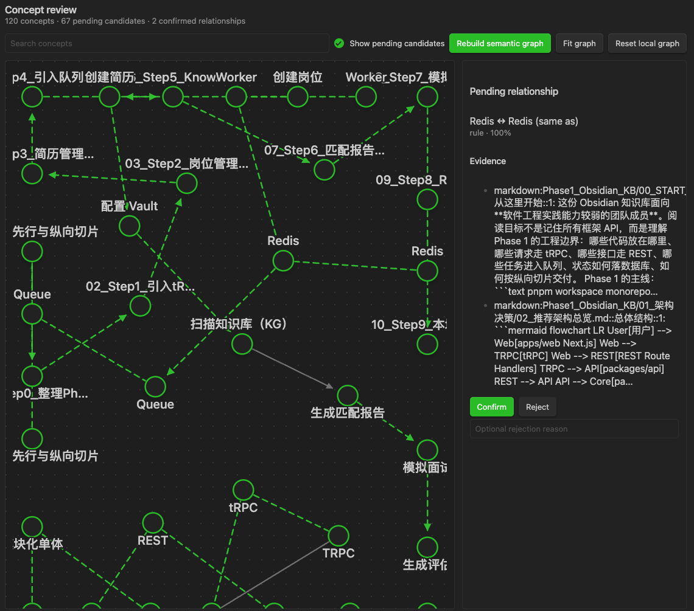
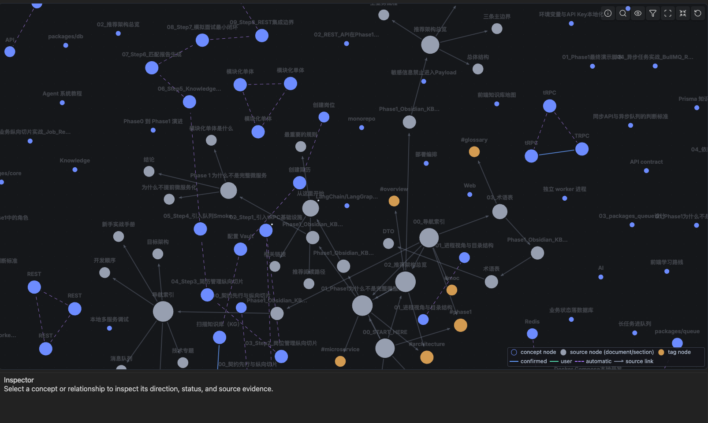
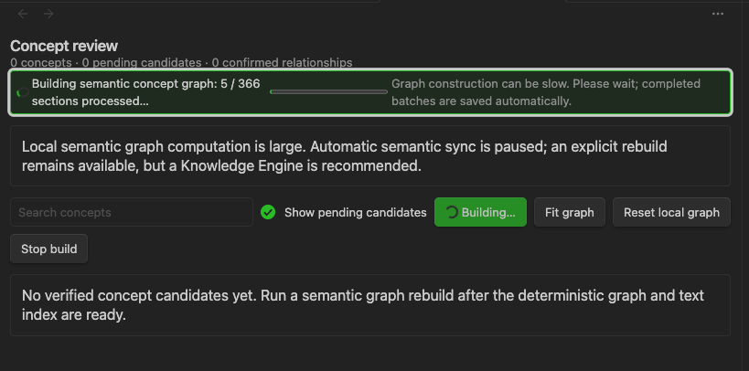
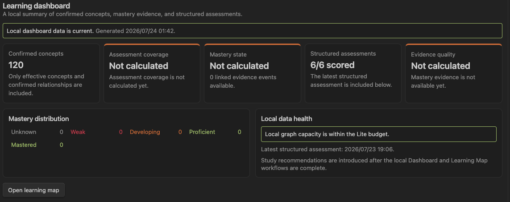
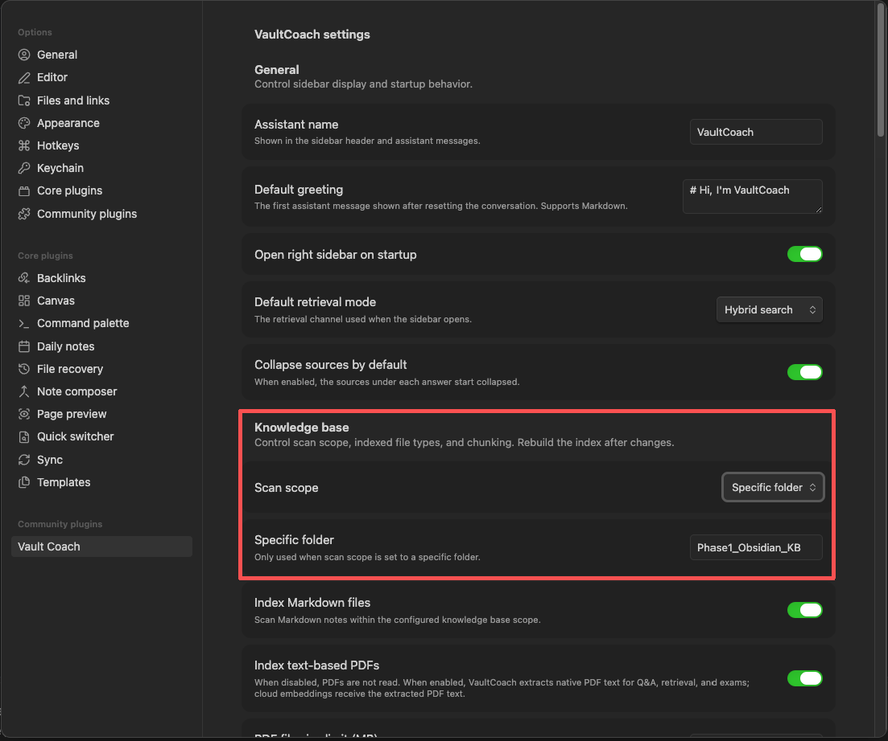
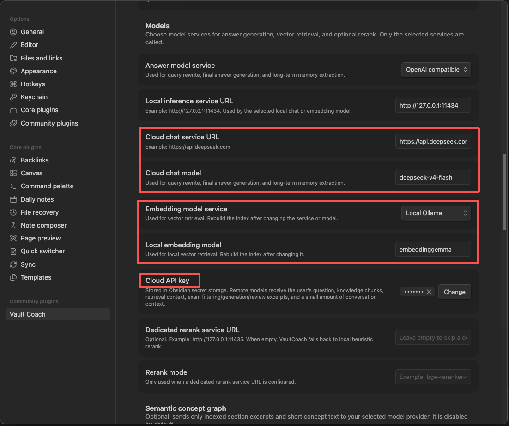

# Vault Coach

> Language: English | [中文](./README_CN.md)

**Turn an Obsidian vault into a learning workflow:** build a source-grounded knowledge base, practise with structured exams, review concept relationships, and use a Learning Map to see what you know and what still needs work.

Vault Coach is an Obsidian plugin for learners, researchers, and teams who want to study from the notes they already maintain. It supports Markdown and text-based PDFs, cited Q&A, scoped practice exams, reviewable concept graphs, and evidence-based mastery tracking.

<!-- Screenshot recommendation: place a 16:9 overview of the Vault Coach sidebar here. Show a cited answer, the Q&A / Exam mode switch, and the index status. Blur or replace personal note names. -->

## What problem does Vault Coach solve?

Notes are useful only when you can revisit, test, and connect them. Vault Coach closes that loop inside the vault you already use:

1. **Find and explain** — ask questions over your Markdown notes and text PDFs; inspect the source behind an answer.
2. **Practise and assess** — generate an exam from a vault, folder, or chosen files; submit answers and keep structured results.
3. **Connect concepts** — extract evidence-backed concept and relationship candidates, then decide what is actually true in Concept review.
4. **Navigate learning** — explore confirmed knowledge in a Learning Map, see evidence-backed mastery states, and act on local study recommendations in the Learning dashboard.
5. **Keep control of data** — choose a local model, a self-hosted endpoint, or an OpenAI-compatible provider. Model calls occur only for the features and provider you configure.

## What you can do

### Build a personal knowledge base

Choose the whole vault or one folder. Vault Coach indexes Markdown and, optionally, native-text PDFs. It chunks content for retrieval while keeping headings, file paths, excerpts, and PDF page locations for citations.

- Keyword, vector, and hybrid retrieval modes
- Optional query rewrite and reranking
- Page-aware citations for text-based PDFs
- Automatic incremental sync for normal file changes
- Configurable PDF size/page limits and chunking
- Optional local long-term memory for durable conversation facts, with a setting to disable it

<!-- Screenshot recommendation: show an answer with several expanded source cards. Include one Markdown heading source and one PDF page source if possible. -->

### Train with exam mode

Exam mode turns selected knowledge into deliberate practice instead of another chat session. You can choose the entire knowledge base, folders, or individual files; inspect and adjust the included files; generate questions; submit answers; and review scoring feedback.

- Scope exams to the material you are studying now
- Persist include/exclude choices for the session
- Filter low-value material such as TODOs, logs, link indexes, stubs, and drafts
- Choose **Simple** mode for single-choice and true/false questions with deterministic on-device 100/0 scoring
- Choose **Challenge** mode for a bounded content-aware mix of supported objective and free-response formats
- Choose an adaptive target—**Diagnostic**, **Weak review**, **Prerequisites**, or **Mixed**—to decide what to practise without changing answer format or scoring
- Analyze the selected material before generation; the preview uses only confirmed Concepts, confirmed prerequisite relations, Mastery, saved assessment evidence, and exact source chunks
- Analysis locks scope, files, question count, exam mode, and adaptive target until you select **Back to settings**; if those facts change before generation, reanalyze instead of silently changing the plan
- Fall back cleanly to a scoped exam when no traceable adaptive target is available; this flow never writes to the knowledge graph
- Save structured assessment records locally and export readable Markdown reports when needed

<!-- Screenshot recommendation: show the exam setup with scope selector, file manager, estimated capacity, and the Generate test button. -->

<!-- Screenshot recommendation: add a second exam image showing a completed result with score, feedback, and source-backed review items. This is more persuasive than another setup screenshot. -->

### Turn notes into a reviewable concept graph

The optional **Semantic concept graph** extracts Concepts and relationship candidates from indexed Sections. It is deliberately review-first:

- Candidates retain source evidence.
- Dashed relationships are proposals; confirmed relationships are distinct facts.
- You can confirm, reject, undo a decision, merge concepts, manage aliases, and add or remove manual relationships.
- Similarity candidates use a bounded approximate-neighbour search; similarity never auto-merges concepts.
- A model-backed semantic rebuild is always explicit. It is not silently triggered just by opening Obsidian.

<!-- Screenshot recommendation: add a Concept review screenshot. Show a readable graph with both dashed candidate edges and solid confirmed edges, a selected Concept inspector, and the confirm / reject controls. -->

### Explore confirmed knowledge in Learning Map

**Learning Map** is the focused reading view of the graph. It presents confirmed and user-created relationships, with directed arrows where the relationship has direction. You can search, filter relationship types, zoom/pan, focus a neighbourhood, inspect source evidence, and jump back to the original note.

Pending or rejected candidates remain out of the Learning Map, so a visual connection is never mistaken for a confirmed learning fact. Optional high-confidence auto-relations are visually distinguished and are display-only; they do not change exams or mastery.

<!-- Screenshot recommendation: add a full-width Learning Map screenshot. Show clustered concept nodes, varied node size, directional relationship arrows, the compact upper-right controls, bottom inspector, and legend. Avoid screenshots where labels overlap. -->

### Follow evidence-based mastery

The **Learning dashboard** summarizes confirmed concepts, assessment coverage, mastery distribution, local data health, and up to five evidence-backed next steps. Mastery is derived from saved structured exam events and confirmed Concept bindings—not from a guess that a note was merely opened.

Recommendations are deterministic local projections of confirmed source-backed Concepts, Mastery, saved assessments, and confirmed prerequisites. You can open their sources, start a source-scoped exam, complete, defer, dismiss, or restore an item, and copy the current plan as Markdown. Those actions are stored locally under `.vault-coach/recommendations/`; they never alter scores, Mastery, or graph facts. An optional Simple/Challenge suggestion is only a hint—you still choose the final mode in exam setup.

Use **Rebuild concept mastery** after taking exams or after changing the effective Concept graph. The resulting snapshot is rebuildable; saved exam sessions remain the durable learning record.

<!-- Screenshot recommendation: add a Learning dashboard screenshot with the five summary cards and mastery distribution. Use a vault with enough completed exams to make the distribution meaningful. -->

## Install

### From Obsidian Community plugins

When Vault Coach is available in the community catalog:

1. Open **Settings → Community plugins** in Obsidian.
2. Turn off Restricted mode if Obsidian asks you to do so.
3. Select **Browse**, search for **Vault Coach**, then install and enable it.

### Manual installation from a release

1. Download `main.js`, `manifest.json`, and `styles.css` from the matching [GitHub release](https://github.com/Wanjin5508/vault-coach/releases).
2. Create `<your-vault>/.obsidian/plugins/vault-coach/`.
3. Put the three files in that folder.
4. Reload Obsidian, then enable **Vault Coach** in **Settings → Community plugins**.

Do not install a source-code ZIP as a plugin release unless you build it first.

## Quick start

### 1. Install and open Vault Coach

1. Install and enable Vault Coach in Obsidian.
2. Open it from the ribbon or run **Open VaultCoach in the right sidebar** from the Command palette.
3. Open **Settings → Vault Coach**.

<!-- Screenshot recommendation: add a settings overview screenshot. Highlight Knowledge base, Models, Semantic concept graph, and Learning Map automatic relations rather than exposing credentials. -->

### 2. Choose the knowledge you want to train on

Under **Knowledge base**:

1. Choose **Entire vault** or **Specific folder**.
2. Enable Markdown indexing and, if needed, text-based PDF indexing.
3. Set sensible PDF limits and chunk settings for the size of your vault.
4. Select **Rebuild index** in the sidebar.

When the build finishes, ask a question to verify that the sources match the intended notes.

### 3. Configure a model provider

Vault Coach does not require a particular provider. Select the chat and embedding providers that fit your environment:

| Option | When to choose it |
| --- | --- |
| Local Ollama | You want a fully local model workflow and can run suitable chat and embedding models on your device. |
| OpenAI-compatible endpoint | You use a cloud provider, a self-hosted gateway, or another compatible service. Configure its URL, models, and API key explicitly. |
| Keyword-only retrieval | You want basic local search without building embeddings. |

Ollama is an optional privacy-oriented deployment path, not a requirement. If you use it, the typical base URL is `http://127.0.0.1:11434`; do not append `/api/chat`, `/api/embed`, or `/api/embeddings`.

### 4. Start a study cycle

1. Ask a cited question to refresh a topic.
2. Switch to **Exam mode** and create a short, scoped test.
3. Submit answers and review feedback.
4. Open **Concept review** to confirm or correct important relationships.
5. Open **Learning Map** and **Learning dashboard** to inspect the confirmed structure and mastery evidence.

This loop works well for interview preparation, certification study, course review, research reading, and project onboarding.

## How to use each workflow

### Ask questions with traceable sources

1. Select **Q&A** in the sidebar.
2. Choose Keyword, Vector, or Hybrid retrieval.
3. Ask a focused question.
4. Expand a source beneath the answer to inspect its excerpt, heading, or PDF page.
5. Use the source link to open the underlying note.

Tips:

- Start with a narrow question when a vault covers several domains.
- Use a folder-specific knowledge scope when a project needs isolation.
- Enable vector retrieval only after configuring an embedding provider and rebuilding the index.

### Create, take, and review an exam

1. Switch to **Exam mode**.
2. Choose the full knowledge base, one or more folders, or a source-scoped exam started from Learning Map.
3. Select **Manage files** to include/exclude individual files, then choose an adaptive target, **Simple** or **Challenge** mode, and a question count.
4. Select **Analyze exam scope** to inspect eligible material and the source-backed adaptive plan. Once analysis completes, the scope, files, question count, smart-filter setting, exam mode, and adaptive target are locked.
5. Select **Generate test**. To change the target, mode, or setup instead, select **Back to settings** first; this discards the completed analysis. If the vault facts change, analyze again rather than reusing the plan.
6. Submit answers, review the result, then use **Save result** or **Export**. Simple-mode answers are scored locally from their answer key; free-response answers retain the configured model-based evaluation path.

Saved assessment facts live in `.vault-coach/assessments/`. They are local vault data and are kept when you rebuild an index or refresh a graph.

### Build and review the semantic graph

1. In settings, enable **Semantic concept graph** and review the selected model provider.
2. Rebuild the normal knowledge index first.
3. Run **Rebuild semantic concept graph** from the Command palette.
4. Run **Open concept review**.
5. Review candidates using their evidence; confirm, reject, merge, or create a manual relationship where appropriate.
6. Use **Open learning map** to explore the confirmed result.

Use semantic graph rebuilding deliberately: it may send indexed Section excerpts to your chosen chat model and short concept text to your selected embedding provider. The exact destination depends on your provider settings.

### Work with Learning Map and dashboard

1. Run **Open learning map**.
2. Search or filter relationships, then select a node or edge.
3. Use **Focus neighbourhood** for a local view; use **Reset exploration** to return to the broader projection.
4. Use **Show source structure** only when you need document/Section/tag context.
5. Run **Open learning dashboard** to check assessment coverage and mastery distribution.
6. Run **Rebuild concept mastery** after new exams or major Concept-review changes.

### When your vault changes outside Obsidian

Vault Coach records a lightweight source inventory with each successful index. If files were added, removed, replaced, or the configured scope changed while the plugin was closed, it will not reuse an old index, graph, or mastery snapshot as if it were current.

1. The sidebar, Learning Map, and dashboard show an update-required message.
2. Select **Rebuild index**.
3. For a substantial domain replacement, optionally run **Reset semantic graph decisions** after reviewing its impact count.
4. Use **Show VaultCoach derived storage usage** to inspect the local footprint by category.

Rebuilding never deletes original notes, saved assessment sessions, or exported reports. It replaces only rebuildable derived data such as indexes, vectors, graph snapshots, and mastery snapshots.

## Command palette reference

| Command | Purpose |
| --- | --- |
| **Rebuild knowledge index** | Re-scan the current knowledge scope and rebuild retrieval data. |
| **Clear knowledge index** | Clear rebuildable index and graph data; saved assessments remain. |
| **Rebuild semantic concept graph** | Explicitly run model-backed Concept/relationship extraction. |
| **Open concept review** | Review concept candidates and make reversible governance decisions. |
| **Open learning map** | Explore the confirmed knowledge graph. |
| **Open learning dashboard** | Inspect concept, assessment, and mastery summaries. |
| **Rebuild concept mastery** | Recalculate the local mastery read model from assessment evidence. |
| **Reset semantic graph decisions** | Clear manual semantic decisions after a deliberate review. |
| **Show VaultCoach derived storage usage** | Read-only breakdown of VaultCoach-managed local data. |

## Privacy, storage, and network use

Vault Coach has no hidden telemetry. It writes its working data inside the current vault, primarily under `.vault-coach/` and the plugin configuration directory.

| Data | Why it is stored | What happens on index rebuild |
| --- | --- | --- |
| Text/vector indexes and graph snapshots | Fast retrieval and graph rendering | Rebuilt from the current knowledge scope |
| Semantic candidates, embeddings, and review decisions | Concept review and Learning Map | Stale source-derived records are reconciled; manual decisions require an explicit reset |
| Mastery snapshot | Fast dashboard reads | Rebuildable from assessment evidence and the effective Concept graph |
| Assessment sessions and exported reports | Your learning history | Preserved |

Network behavior is controlled by your model settings:

- A local Ollama configuration keeps model requests on the local endpoint you configure.
- An OpenAI-compatible provider may receive the text required for the feature you explicitly run: for example, retrieved context for Q&A, Challenge-mode exam generation or free-response scoring, or Section excerpts for semantic extraction. Simple-mode objective scoring is local.
- The deterministic structural graph and source-inventory comparison do not call a model or network service.

Treat `.vault-coach/` as private vault data. It can include note excerpts, filenames, headings, answers, feedback, graph evidence, and model metadata. Do not commit it to a public repository unless you have reviewed its contents.

## Current limits

- PDF support is for PDFs with a native text layer. OCR for scanned PDFs is not included.
- Complex PDF tables, diagrams, formulas, and multi-column layouts may need manual verification.
- Challenge-mode generation and free-response scoring are study aids produced by your configured model, not authoritative grading. Simple-mode objective scoring is deterministic from the generated answer key, so answer-key quality still depends on the source material and generation step.
- Concept extraction quality depends on the source material and selected model; review is intentional, not a failure mode.
- Large knowledge bases may pause new local semantic work to protect the Obsidian UI. Existing indexing, Q&A, exams, and confirmed graph reads remain available.

## Contributing

Issues and pull requests are welcome. For a bug report, include reproduction steps, Obsidian and plugin versions, provider/model details, relevant non-secret settings, and console errors or screenshots.

## License

[MIT License](./LICENSE)
