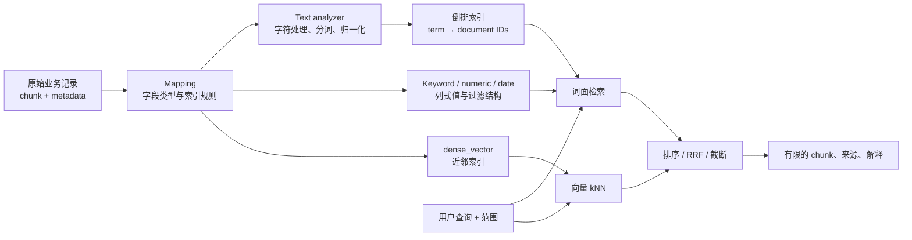
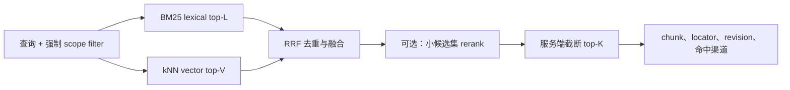
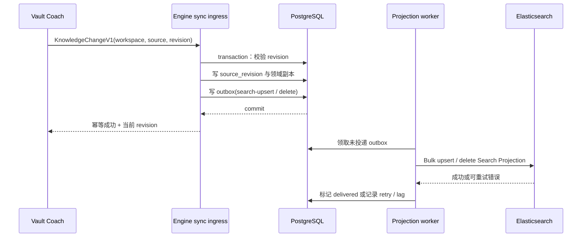

---
tags:
  - KnowledgeEngine
  - Elasticsearch
  - 全文检索
  - 向量检索
  - 混合检索
  - 教程
status: design-baseline
updated: 2026-07-26
depends-on:
  - 01-需求规格.md
  - 02-架构设计.md
---

# 03 Elasticsearch：从检索原理到 Knowledge Engine 加速层

> 学习顺序：先理解 Elasticsearch 如何把文本和向量变成可搜索索引，再理解它与 PostgreSQL 的分工，最后阅读 Knowledge Engine 的具体投影、写入和采用决策。本文定义的是设计基线，不代表 Vault Coach Lite 已经引入 Elasticsearch。

## 0. 本章要回答的问题

Elasticsearch（以下简称 ES）适合解决“如何在大量文本中快速、可解释地找到相关片段”的问题，但它不适合充当所有业务事实的唯一存储。本章依次回答：

1. 全文检索、向量检索和混合检索分别在做什么；
2. ES 的索引、mapping、analyzer、kNN、RRF、filter 分别发挥什么作用；
3. 为什么 Engine 仍应以 PostgreSQL 为事实层，而把 ES 设计成可重建的搜索投影；
4. 在 Vault Coach 的知识库、语义窗口、图谱和考试场景中，ES 能加速什么、不能解决什么；
5. 什么条件下值得把它作为可选 Docker 服务引入。

## 1. Elasticsearch 的基本原理与作用

### 1.1 它本质上是什么

ES 是建立在 Lucene 之上的搜索与分析引擎。应用把一条业务记录投影成一个 JSON document，并声明每个字段该以何种方式被索引；ES 再把它组织为适合查询的专用数据结构。它的核心目标是：用额外的索引空间和写入成本，换取低延迟的文本、过滤、聚合和向量查询。

不要把 ES 的 “document” 与 Markdown 文件混为一谈：

- 在 ES 中，document 是一条可索引记录；
- 在 Knowledge Engine 中，一条 document 应对应一个稳定的 **chunk**，即一个带来源定位的语义窗口；
- 一篇笔记会产生多个 chunk；一个 Concept 或 Relation 则是另一类领域事实，不能因为能被搜索就变成 ES 的权威数据。

### 1.2 为什么关系数据库的普通查询不够

关系数据库擅长事务、约束、关联、审计和按明确条件查找。例如“取工作区 A 中 revision 为 42 的 chunk”非常适合 SQL。但“找出同时提到 *向量召回*、语义接近 *RAG 延迟*、位于某目录、且需要突出命中片段的前十个 chunk”，需要组合下列能力：

- 从自然语言中拆分和归一化词元；
- 使用倒排索引快速找到包含这些词元的候选；
- 对标题、正文、路径、标签施加不同权重；
- 对结构化元数据做过滤与聚合；
- 对 embedding 做近邻搜索；
- 合并词面与语义两条候选列表。

PostgreSQL 也能通过 FTS、`pgvector` 等提供其中一部分能力。因此 ES 不是“必须组件”，而是在上述组合需求、规模或运维要求已超出 PostgreSQL 基线时的专用加速器。

### 1.3 索引查询的心智模型



其中最重要的三个概念是：

| 概念 | 原理 | 带来的能力 | 常见误解 |
| --- | --- | --- | --- |
| Mapping | 在建索引前声明字段是 `text`、`keyword`、数值、日期或向量等 | 防止 ID、路径、正文、向量被用错误方式处理 | 让动态 mapping 自动猜测所有字段并不等于省事；它会把后续迁移变得不可控 |
| Analyzer | 对 `text` 执行字符处理、tokenize、lowercase、stemming、synonym 等步骤 | 让“词形变化”“大小写变化”“中文切词”等能参与全文匹配 | analyzer 不理解业务真相，也不会验证模型推断是否正确 |
| Search projection | 从事实库复制出仅供查询的字段和索引 | 查询可以快、可替换、可重建 | 投影不是事实源；投影落后或损坏不应覆盖业务事实 |

ES 对 `text` 字段在索引和查询时执行分析，把非结构化文本转换为可检索 token；官方文档将 analyzer 描述为可控制文本预处理、tokenization 和归一化规则的组合。参见 [Elastic：Text analysis](https://www.elastic.co/docs/manage-data/data-store/text-analysis)。

## 2. 三类检索能力：原理、价值与边界

### 2.1 全文检索：倒排索引与词面相关性

**原理。** 倒排索引记录“某个 token 出现在哪些 document 中”，与逐篇扫描原文相反。查询 `知识图谱 检索` 时，系统先找到两个 token 对应的候选 document，再依据词频、位置、字段权重等计算相关性。典型词面排序使用 BM25 一类算法。

**作用。** 它特别擅长：

- 专有名词、API 名、文件名、报错文本、命令、代码标识符；
- 标题、章节和精确短语的命中；
- 高亮显示“为什么这个 chunk 被命中”；
- 按路径、tag、文档类型、时间等结构化字段筛选后再搜索。

**边界。** 词面检索不知道“召回”和“retrieve”在某段上下文中是否语义相近，也不会判断一段笔记是否讲对了概念。它提供的是候选和排序信号，不是事实判定器。

#### `text` 与 `keyword`：两种不同的字段职责

| 字段类型 | 索引方式 | 适用内容 | 不适用内容 |
| --- | --- | --- | --- |
| `text` | analyzer 后形成 token | 标题、章节路径、正文、摘要 | 稳定 ID、权限边界、完整文件路径 |
| `keyword` | 保留完整值，通常可做 filter/aggregation | `workspace_id`、`chunk_id`、路径、tag、文档类型、模型版本 | 需要按词或短语匹配的大段正文 |
| `long` / `date` / `boolean` | 数值、时间或布尔索引 | revision、长度、时间、是否 active | 自然语言正文 |

在同一个逻辑字段上保留多字段是合理的：例如标题可有 `title.search`（`text`）与 `title.exact`（`keyword`）。这样既能搜索标题词语，也能精确过滤完整标题。

#### 中文与多语言分析

中文、英文、代码和路径的文本特征不同，不能用一个 analyzer 草率处理。

1. 路径、ID、tag、版本号使用 `keyword` 或 normalizer，不能被自然语言分词破坏；
2. 标题、heading 和正文使用独立字段，可在查询时给予标题更高权重；
3. 中文 tokenizer/analyzer 的选择必须在真实语料上以召回、误召回和延迟验证；不把某个第三方分词插件写死为架构前提；
4. 英文词干化、同义词扩展只用于已验证的字段和语种；
5. 同义词表属于人工维护、版本化的检索配置，不能让 LLM 在生产环境自动写入；
6. 代码、命令和文件名应保留可精确匹配的子字段，避免被普通自然语言分析器损坏。

### 2.2 向量检索：embedding、距离与近似近邻

**原理。** embedding 模型将一个 chunk 或查询编码为固定维度的数值向量。相似语义的内容在向量空间中往往更接近。查询时，用查询向量寻找距离最近的 `k` 个 chunk，这就是 k-nearest neighbors（kNN）。ES 使用 `dense_vector` 字段保存这类向量；该字段主要用于 kNN，不能像普通数值字段那样用于聚合或排序。参见 [Elastic：Dense vector field type](https://www.elastic.co/docs/reference/elasticsearch/mapping-reference/dense-vector)。

**精确与近似。**

| 方案 | 原理 | 优点 | 代价 / 适用性 |
| --- | --- | --- | --- |
| Exact kNN | 对过滤范围内的候选逐个计算相似度 | 结果精确、实现简单 | 数据量大时扫描成本高；适合小范围或 rerank |
| Approximate kNN | 预先构建近邻图/其他专用结构，仅探索部分候选 | 低延迟、适合大规模 top-K | 结果近似，需要调参与基准验证 |
| HNSW | 常见的分层近邻图（Hierarchical Navigable Small World） | ANN 召回和延迟的成熟折中 | 构建、内存/磁盘、过滤行为都需要测量 |
| Quantization + rescore | 用压缩向量先筛候选，再用更完整表示复排 | 降低向量索引资源压力 | 会引入精度/成本取舍，不能凭感觉启用 |

ES 的近似 kNN 基于 HNSW；它通过牺牲部分准确性换取速度。向量索引写入本身有明显成本，因此 embedding 生成、索引和重建都应作为可取消的后台任务，而不是 Obsidian 主线程工作。参见 [Elastic：Approximate kNN performance](https://www.elastic.co/docs/deploy-manage/production-guidance/optimize-performance/approximate-knn-search)。

**关键参数。**

- `k`：希望最终从单个 kNN retriever 获得的结果数；
- `num_candidates`：每个 shard 在近似搜索中探索的候选预算；通常越大，召回越可能提高，但延迟和资源也会上升；
- `dims`、相似度度量、embedding model version：必须同向量字段一起版本化；模型或维度改变意味着不能混用旧索引；
- 量化策略、oversampling、rescore：只在 benchmark 证明内存/磁盘压力和质量收益后采用。

**边界。** 向量相似度只表示“检索信号相近”，不表示“二者是确认的图谱关系”，更不能作为用户掌握某个 Concept 的证据。它最多生成候选、排序或辅助人工审核。

### 2.3 Filter：先限制“能看什么”，再讨论“相关什么”

搜索系统中的 filter 是范围、隐私和正确性的边界。Knowledge Engine 的每次检索都必须先应用：

- `workspace_id`；
- 用户已授权的 source scope；
- `active` / 删除状态；
- 可选 folder、tag、文档类型、时间和 revision 条件。

过滤必须下推到 ES / PostgreSQL 查询，而不是先从全库召回、再在 Node 进程中删结果。特别是向量检索中，严格 filter 既是数据隔离边界，也会影响 ANN 的候选探索成本；极小范围有时精确扫描反而更合适。ES 官方的 [Filtered kNN 指南](https://www.elastic.co/docs/solutions/search/vector/knn) 也说明了过滤与近似 kNN 之间的这类取舍。

### 2.4 混合检索：词面与语义为何要合并

词面检索能准确抓住 “`GraphSnapshotV1`” 或具体报错；向量检索能覆盖“如何降低 RAG 延迟”与“检索速度优化”这类用词不同但语义接近的表达。二者并非替代关系。

**RRF（Reciprocal Rank Fusion）** 是一种按名次融合多个结果列表的方法：

```text
RRF(document) = Σ 1 / (rank_constant + document 在某个列表中的名次)
```

它不要求 BM25 分数和向量相似度拥有相同数值尺度，适合先独立生成词面 top-L 与向量 top-V，再按名次合并。ES 的 RRF retriever 可以组合多个子 retriever；`rank_window_size` 增大可能改善相关性，但也会增加成本。参见 [Elastic：Reciprocal rank fusion](https://www.elastic.co/docs/reference/elasticsearch/rest-apis/reciprocal-rank-fusion)。



RRF 只负责排序。它不可以绕过 filter、扩大查询范围、生成图谱关系或覆盖 PostgreSQL 中的治理决定。

## 3. 从检索技术到工程架构：事实库与搜索投影

### 3.1 为什么 PostgreSQL 与 ES 应并存而非互相取代

Knowledge Engine 需要两类完全不同的保证：

| 能力 | PostgreSQL 的角色 | Elasticsearch 的角色 |
| --- | --- | --- |
| revision、幂等与事务 | **权威**：写入 source revision、领域副本、outbox、job | 不承担跨表事务或水位线真相 |
| 删除、授权、审计 | **权威**：保留最小审计和删除语义 | 异步删除 projection，可能短暂滞后 |
| Concept、confirmed relation、Assessment evidence | **权威**：关系、约束、证据和治理记录 | 最多复制少量 filter/boost 字段，不决定有效事实 |
| 全文、highlight、复杂 filter 聚合 | 可作基线 FTS | **加速**：倒排索引和搜索 DSL |
| 向量近邻与混合检索 | 可作 pgvector 基线 | **可选加速**：kNN、RRF、检索观测 |
| 索引故障后的恢复 | 通过事实和 outbox 重建 | 可删除后完全重建 |

因此本项目采用 **PostgreSQL 事实层 + ES Search Projection** 的模式。它类似 CQRS 中的读模型：写入保证正确性，读模型为特定查询优化。代价是接受有限的最终一致性；收益是 ES 损坏、重建、升级时不丢失用户事实。

### 3.2 一致性模型：Outbox，而不是双写

如果 API 请求同时“写 PostgreSQL，再写 ES”，其中一次成功、另一次失败，就会产生难以恢复的不一致。正确做法是把事实写入和“需要投影”的事件放在同一个 PostgreSQL 事务中，再由 worker 异步投影。



这条链路带来明确规则：

1. 插件只同步版本化 `KnowledgeChangeV1`，**绝不直接写 ES**；
2. `(workspaceId, sourceId, revision)` 可安全重放；旧 revision 不能覆盖新 revision；
3. 删除先在 PostgreSQL 成为事实，再经 outbox 删除 ES document；
4. ES 不可用时，outbox 积压并报告 index lag，不要求插件整库重传；
5. 搜索响应携带 `chunkId`、`sourceRevision`、index version 和截断原因；应用层可识别过旧命中并降级。

### 3.3 写入与读出的最终一致性边界

ES projection 是异步更新的，因此“刚同步一篇笔记”与“立即在 ES 检索到它”之间可能有短暂间隔。这个事实不能被 UI 隐藏，应体现在 Engine 的 job/progress/diagnostics 中。

对于需要最新数据的操作，可采用以下顺序：

1. UI 显示正在处理的 revision 与索引进度；
2. 检索接口返回 `indexedRevision` / lag；
3. 如果 ES 尚未追上，Engine 用 PostgreSQL 基线检索，或返回可解释的“索引同步中”降级；
4. 不因 ES 没追上而把旧结果当成当前事实，更不能让旧结果进入 Mastery 或 effective graph。

## 4. Knowledge Engine 的具体应用设计

### 4.1 先说明当前项目处于哪里

| 层级 | 当前状态 | 结论 |
| --- | --- | --- |
| Vault Coach Lite | 已有 `VaultKnowledgeBase`、`EmbeddedExactVectorStore`、`AdvancedRagEngine`、本地图谱/考试链路 | Lite 无 Docker、无 ES 依赖，继续作为默认路径 |
| 插件 Engine 接缝 | 已有 `KnowledgeEngineClient` 与 `LiteEngineClient` | 当前只报告 `mode: lite`，零网络请求；尚没有 ES client |
| Knowledge Engine Local | 文档已设计 PostgreSQL + pgvector、revision、outbox、job | 这是服务端事实与检索基线，仍待独立实现 |
| Elasticsearch | 本文定义可选 Search Projection | 只能在 KE-3 基准证明收益后作为 Docker profile 引入 |

这意味着 ES 不能修复 Lite 中的任何即时问题，也不应作为“知识库格式混乱”的替代品。特别是一个巨大的 `00` 文件仍应在 ingestion 阶段按 section/chunk 进入索引；ES 可以更快找到 chunk，却无法自动把结构不清的原文变成可信的知识图谱或 MOC。

### 4.2 哪些 Vault Coach 场景从 ES 受益

| 场景 | 技术组合 | 用户可见收益 | ES 不负责的部分 |
| --- | --- | --- | --- |
| Ask 中的带证据问答 | 标题/正文 BM25 + embedding kNN + RRF + highlight | 更快找到术语精确且语义相关的来源 chunk | 最终回答的生成、来源引用策略、模型安全 |
| 中英混合技术库 | 每个文本字段的 analyzer 方案 + path/tag filter | 更可控的中文、英文、代码和路径匹配 | 自动判断某个分词器“永远最好” |
| 大知识库范围过滤 | `workspace_id`、folder、tag、type、active 预过滤 | 搜索/考试只看用户选定范围，避免全库候选 | 用 filter 取代授权或领域校验 |
| Learning Map 的局部探索 | 搜索可给出候选根节点/证据 chunk | 更快定位用户想看的局部主题 | 整图 BFS、confirmed relation、证据判定仍由 PostgreSQL/领域服务负责 |
| Concept Review 的候选召回 | ANN top-K + metadata/source filter + 小集 rerank | 避免 N² 全量概念比较 | ANN 分数不能自动确认 relation |
| 诊断与运维 | index alias、outbox lag、query profile、bulk 指标 | 识别“索引慢”是模型、写入、合并还是查询问题 | 把观测数据当用户内容保存 |

### 4.3 一个 chunk 的 Search Projection

一个 ES document 对应一个可检索 chunk，不对应整篇文件。下面字段是 Engine 的设计示例，不是插件直接发送给 ES 的 payload：

```json
{
  "workspace_id": "workspace-abc",
  "chunk_id": "chunk:note-rag:12",
  "section_id": "section:note-rag:3",
  "source_id": "note:rag",
  "source_revision": 42,
  "file_path": "notes/rag.md",
  "folder_path": "notes",
  "document_type": "markdown",
  "title": "RAG architecture",
  "heading_path": ["Retrieval", "RAG architecture"],
  "tags": ["rag", "search"],
  "content": "…已获授权的 chunk 文本…",
  "content_vector": [0.01, -0.02],
  "concept_ids": ["concept:retrieval", "concept:rag"],
  "active": true,
  "embedding_model_version": "model@version",
  "indexed_at": "2026-07-26T12:00:00Z"
}
```

| 字段组 | ES 类型建议 | 检索用途 | 数据治理要求 |
| --- | --- | --- | --- |
| `workspace_id`、`chunk_id`、`source_id` | `keyword` | 强制 scope、幂等 ID、来源定位 | 不允许 analyzer 改写；复合 document ID 可为 `workspaceId:chunkId` |
| 路径、类型、tag、`concept_ids` | `keyword` / keyword 数组 | folder/tag/type filter、聚合、有限 boost | `concept_ids` 只是投影过滤信号，不取代 PG 的 effective concept |
| 标题、heading、正文 | `text` + 显式 analyzer | BM25、短语、highlight；标题可提高 boost | analyzer 与语料、语言、版本绑定 |
| `source_revision`、`indexed_at`、token count | `long` / `date` | freshness、lag、诊断和预算 | 返回给调用方以检测陈旧结果 |
| `active` | `boolean` | 软删除/迁移期间过滤 | 仍以 PostgreSQL 删除事实为准 |
| `content_vector` | `dense_vector` | kNN 候选召回 | 固定 dims、相似度、模型版本；不得混用不同 embedding 空间 |

### 4.4 Mapping、版本和别名

mapping、analyzer、chunk schema、embedding 模型或维度改变时，不能假设旧索引可以原地兼容。采用不可变物理 index 与 alias：

```text
ke-chunks-v1-20260726-001   # 物理 index：新 mapping 与数据
ke-chunks-current           # 查询 alias
ke-chunks-write             # 可选的写入 alias
```

迁移流程为：创建新 index → 从 PostgreSQL/revision 回填 → 校验 document count、revision 水位和检索样本 → 原子切换 query alias → 保留短暂回滚窗口 → 删除旧 index。这样 analyzer 或 vector schema 变更不会污染正在服务的读索引。

### 4.5 有界 Retrieval API

插件面对的不是 ES DSL，而是 Engine 的受限 DTO。例如：

```ts
interface RetrievalRequestV1 {
  workspaceId: string;
  query: string;
  scope: { sourceIds?: string[]; folderPaths?: string[]; tags?: string[] };
  mode: "lexical" | "vector" | "hybrid";
  limit: number; // Engine 再以服务端 max 裁剪
}

interface RetrievalHitV1 {
  chunkId: string;
  sourceId: string;
  sourceRevision: number;
  locator: { filePath: string; heading?: string; pageStart?: number };
  excerpt: string;
  channels: Array<"lexical" | "vector">;
}
```

服务端固定并记录 `L`（词面候选）、`V`（向量候选）、`R`（可 rerank 候选）和 `K`（最终返回数）的最大预算。响应还应包含检索模式、alias/version、embedding model version、实际 filter、`indexedRevision`、是否降级和截断原因。插件不能传任意 ES query、任意 index 名或无界候选数量。

### 4.6 投影 worker 的实现要点

| 步骤 | 实现 | 目的 |
| --- | --- | --- |
| 1. 领取 outbox | 依据 lease、重试次数与 revision 顺序领取未投递事件 | 服务重启后仍可恢复，不重复投影旧 revision |
| 2. 形成 projection | 从 PostgreSQL 读取当前授权 chunk、metadata、已允许投影的特征 | 不把未授权正文、密钥、聊天记录带入 ES |
| 3. Bulk 写入 | 按批 upsert/delete 到 write alias，记录每项失败 | 降低网络往返；局部失败可重试 |
| 4. 回写状态 | 写 delivered、失败摘要、attempt、indexed revision | 查询和运维能解释 lag |
| 5. 处理迁移 | 新旧 index 并行回填，校验后 alias 切换 | mapping/模型变更可回滚 |
| 6. 垃圾回收 | 在回滚窗口后删除旧 index/过期投影 | 控制磁盘，不删除 PostgreSQL 事实 |

## 5. 采用决策：为什么现在不立即引入 ES

### 5.1 已确定的决策

1. **PostgreSQL 不被取代。** 它保存 workspace、source revision、section/chunk 身份与 locator、effective Concept、confirmed relation、Assessment evidence、job、授权和删除审计。
2. **ES 只保存可重建的 Search Projection。** ES 索引的损坏、延迟、mapping 迁移或删除，最多使 Engine 检索降级，不得覆盖 Vault、Assessment 或图谱治理事实。
3. **Obsidian 插件不直接访问 ES。** 插件只调用版本化的 Engine API；ES 位于 Docker 内部网络，插件只在用户明确启用后调用 Engine 的 loopback API。
4. **Lite 不依赖 ES。** Engine 停止、未安装、协议不兼容或 ES 故障时，Ask、Exam、Learning Map、Mastery 和 Recommendation 必须继续走 Lite 或已经存在的本地数据。
5. **ES 不产生高影响事实。** 向量相似度、RRF 排名、高亮和聚合可用于检索和候选，不可自动确认 relation、写入掌握度或替代人工治理。

### 5.2 采用门槛：先与 PostgreSQL 基线比较

KE-0 至 KE-2 的基线是 PostgreSQL + pgvector + PostgreSQL FTS、revision、outbox 与 job。是否增加 ES，必须在 KE-3 做相同语料、相同 scope 规则下的匿名 benchmark。

| 指标 | 对比方法 | 决策意义 |
| --- | --- | --- |
| 检索质量 | 人工标注 query 集上的 Recall@K、nDCG@K、术语精确命中、来源正确性 | ES 必须有可感知的质量或可解释性收益，不只是“能跑” |
| 查询性能 | lexical/vector/hybrid 的 p50、p95、超时率；分别测全库和窄 filter | 判断搜索加速是否值得额外组件 |
| 写入代价 | 首次全量导入、1% 增量更新、删除、模型/映射迁移耗时 | 验证 outbox、Bulk 与 alias 方案是否可运维 |
| 资源成本 | 内存、磁盘、JVM、filesystem cache、CPU、Docker 启动和备份体积 | Local 用户的机器是否承受得起 |
| 运维复杂度 | 升级、故障恢复、索引重建、数据删除、日志可观测性 | 不能为了少量收益把用户带入不可排障的多服务环境 |

在这些指标没有显示明确收益之前，ES 应保持为设计选项，而不是默认依赖。

### 5.3 分阶段路线

| 阶段 | 决策 | 可交付物 |
| --- | --- | --- |
| KE-0 | 冻结 Search Projection、Retrieval DTO、权限/scope 语义和 benchmark 语料 | 类型、样例 payload、基准方案 |
| KE-1～KE-2 | 先实现 PostgreSQL 事实层、pgvector 基线、revision、outbox、durable job | 可恢复、可删除、可降级的 Engine 基线 |
| KE-3 | 实现 ES POC，对比 PostgreSQL FTS + pgvector 与 ES lexical + kNN + RRF | 基准报告与明确的采用/不采用结论 |
| KE-3（采用时） | 作为可选 Docker profile 接入 ES worker、Bulk、alias migration 与监控 | 不影响 Lite 的增强检索配置 |
| KE-4 以后 | 继续让 ES 仅承担检索读模型 | PostgreSQL 保留事实、图谱治理、Assessment 和 job 的权威性 |

### 5.4 部署、隐私与许可约束

- 首个 Local profile 使用单节点、单 shard 的保守配置；只有 benchmark 证明必要时才增加 shard/replica；
- ES 仅暴露在 Docker 内部网络，外部只暴露 Engine loopback API；
- ES document 只能包含用户授权的投影字段。日志不得记录正文、embedding、聊天内容或 API key；
- 删除流程以 PostgreSQL 事实为起点，经 outbox 传播到 ES，并可观测到完成状态；
- 记录 outbox lag、Bulk 成败、重试、query p50/p95、索引大小、segment merge、JVM/文件缓存和 alias version；
- Elastic 的功能层级、发行方式和许可证会随版本/部署方式变化；在采用或再分发 Docker 方案前，必须基于当时版本复核 [订阅与功能说明](https://www.elastic.co/subscriptions/) 和 [许可 FAQ](https://www.elastic.co/pricing/faq/licensing/)。

## 6. 结论与检查清单

ES 对 Knowledge Engine 的正确定位是：**PostgreSQL 事实层之后、面向 chunk 的可重建全文/向量/混合检索加速层。**

在决定引入前，逐项确认：

- [ ] 已能在 PostgreSQL 中重放 revision、处理删除、保存事实，并通过 outbox 恢复投影；
- [ ] 一个 ES document 明确对应一个有 locator 和 revision 的 chunk；
- [ ] workspace 与授权范围是 ES 查询的强制 pre-filter；
- [ ] mapping、analyzer、embedding model/dims 都已版本化并有 alias 重建方案；
- [ ] 检索结果返回来源、revision、渠道、截断与降级信息；
- [ ] ANN、RRF、rerank 只影响候选排序，不制造 confirmed graph 或 mastery 事实；
- [ ] ES 故障、停止或落后时，插件仍能使用 Lite，Engine 能报告可解释的降级；
- [ ] 基准结果已证明相对 PostgreSQL 基线的质量、延迟或运维收益足以覆盖 ES 的资源与复杂度。

满足这些条件后，ES 才是提升 Knowledge Engine 检索能力的合理工具；否则，先把 PostgreSQL、chunk 边界、证据链和 Lite 体验做好，收益更直接且风险更低。

## 参考资料

- [Elastic：Text analysis](https://www.elastic.co/docs/manage-data/data-store/text-analysis)
- [Elastic：Dense vector field type](https://www.elastic.co/docs/reference/elasticsearch/mapping-reference/dense-vector)
- [Elastic：Approximate kNN performance](https://www.elastic.co/docs/deploy-manage/production-guidance/optimize-performance/approximate-knn-search)
- [Elastic：kNN search and filtered kNN](https://www.elastic.co/docs/solutions/search/vector/knn)
- [Elastic：Reciprocal rank fusion](https://www.elastic.co/docs/reference/elasticsearch/rest-apis/reciprocal-rank-fusion)
