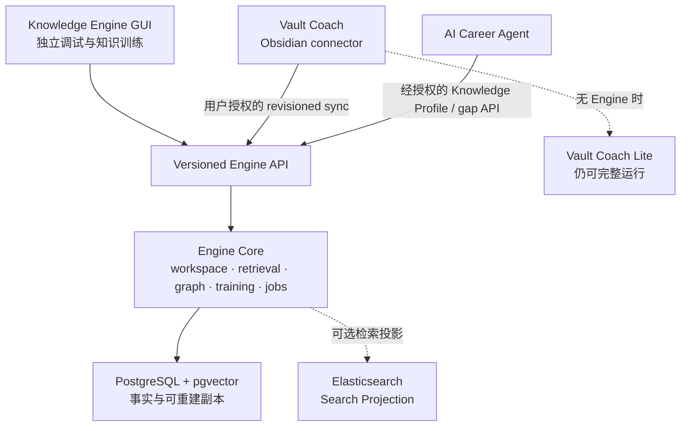
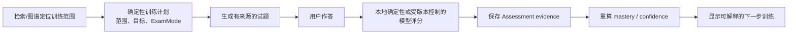
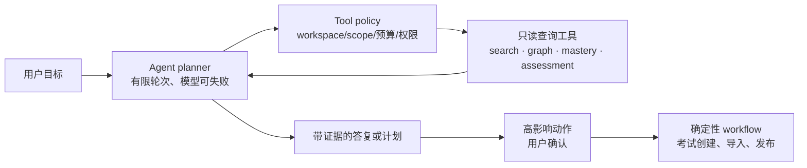

---
tags:
  - KnowledgeEngine
  - 独立工作台
  - 知识训练
  - Agent
  - RAG
  - 考试
status: proposed-design
updated: 2026-07-26
depends-on:
  - 01-需求规格.md
  - 02-架构设计.md
  - 03-Elasticsearch检索加速层.md
related:
  - 00-开发者能力地图.md
  - 05-语言、客户端与桌面发行策略.md
  - ../v1.3.4后续开发日志/开发规划与过程记录/KnowledgeEngine-Local-后续开发路线图.md
  - ../v1.3.4后续开发日志/开发规划与过程记录/三个项目协同架构与责任边界.md
---

# 04 Knowledge Engine：独立工作台、知识训练与 Agent 设计

## 1. 决策摘要

Knowledge Engine 不再只被定义为 Vault Coach 的高性能后端，而是一个可独立启动、独立验证、也可通过版本化接口与 Vault Coach、AI Career Agent 协同的 **本地优先知识训练平台**。

它具有三个同等重要的入口：

```text
独立用户                 Obsidian 用户                    Career Agent 用户
浏览器中的 Engine GUI    Vault Coach Connector           经授权的 Capability API
        │                        │                                  │
        └──────────────────── Knowledge Engine ────────────────────┘
                         工作区、检索、图谱、训练、任务、证据
```

这项决策的目的不是复制 Obsidian 或 Career Agent，而是让三者能独立运行、各自解决最擅长的问题：

| 产品 | 最适合的用户与任务 | 不应承担的责任 |
| --- | --- | --- |
| Vault Coach Lite | 轻量笔记学习、低配置、本地 Obsidian 流程 | 大规模计算、服务端任务恢复、独立知识工作台 |
| Knowledge Engine | 重度知识库、检索/图谱调试、训练、考试、可控 Agent | 笔记编辑器、职业投递和职位业务 |
| AI Career Agent | 简历、JD、投递、面试和职业决策 | 任意扫描 Vault、重建通用知识图谱 |

## 2. 独立运行的含义

“独立”不能只意味着 API 可以启动；用户必须不安装 Obsidian 也能完成一条完整且可验证的知识训练闭环：

```text
创建 Engine workspace
  → 导入资料并检查 section/chunk
  → 建立索引与图谱任务
  → 检索、查看来源与图谱证据
  → 生成并完成考试
  → 查看 Assessment、掌握度和下一步训练建议
```

首版 GUI 固定为由本地 Engine 在 loopback 地址提供的 **React + TypeScript Web Workbench**：Docker 部署、自动化测试、网络调试和后续受限远程访问都更直接。KE-9 再以 **Electron** 把同一静态 Web UI 与同一 HTTP API 封装为可直装的 macOS 应用；它负责启动、健康检查和停止本地服务，不复制业务逻辑。Mac App Store 的沙盒构建，以及 Tauri/Rust 的替代外壳，只在真实性能、安装或发行数据证明有必要时评估。具体技术基线和发行决策见[语言、客户端与桌面发行策略](./05-语言、客户端与桌面发行策略.md)。

### 2.1 两种工作区来源模式

独立性不能制造两个相互覆盖的“源事实”。每个 `workspace` 必须显式记录 `sourceMode`：

| 模式 | 创建方式 | 原始内容与权威 revision | Engine 可以写入什么 | 禁止行为 |
| --- | --- | --- | --- | --- |
| `managed` 独立工作区 | 用户通过 GUI/CLI 显式导入 Markdown、PDF 或目录快照 | Engine 数据卷内的已导入 source revision 是该工作区的训练事实；导入原文件仍归用户所有 | 已导入内容、chunk、图谱治理、Assessment、掌握度、索引和 job | 未经用户操作扫描任意本地路径；把导入内容同步给其他产品 |
| `connector` Vault 工作区 | Vault Coach 显式同步 `KnowledgeChangeV1` | Vault 是原始内容、M2/M3 治理及插件 Assessment 的权威；Engine 只是 revisioned replica | 授权副本、索引、可重建读模型、Engine 侧任务结果 | 覆盖 Vault、静默写回笔记或把候选升格为 confirmed fact |

两种模式可以使用同一 chunk、retrieval、graph 和 training domain API，但不能共享未标记的数据所有权。跨模式复制必须是用户显式导入/导出或受授权同步。

### 2.2 与三个项目的运行关系



## 3. GUI：既是产品界面，也是验证与调试工作台

GUI 的首要价值是可观察性。任何“检索错误”“图谱为空”“任务很慢”“考试覆盖异常”都应该能在 Engine 自身定位，而不是必须回到 Obsidian 猜测。

| 工作区 | 用户目标 | 最小功能 | 必须展示的验证信息 |
| --- | --- | --- | --- |
| Workspace / Sources | 创建、导入、删除、确认数据边界 | source mode、导入清单、revision、hash、授权范围 | 文件/section/chunk 数、失败项、删除影响、存储占用 |
| Index & Jobs | 发起、观察和取消重计算 | 文本/向量/图谱任务、队列、重试、取消、重建 | 输入 revision、阶段、进度、耗时、错误摘要、index lag |
| Retrieval Inspector | 调试 RAG 查询 | lexical/vector/hybrid、scope filter、top-K、可选 rerank | 每个 hit 的 chunk、locator、revision、命中渠道、截断/降级原因 |
| Graph Explorer | 查询而非盲画全图 | 根节点、relation filter、depth/node/edge budget、证据展开 | effective revision、边方向/类型、证据、被预算裁剪的数量 |
| Training / Exam | 独立完成学习练习 | 考试范围、simple/challenge、作答、评分、历史、复盘 | 题目来源、评分路径、Assessment 事件、Concept binding、掌握度变化 |
| Agent Console | 执行有限的多步骤任务 | 目标、计划、工具调用、取消、最终答复 | tool 参数摘要、来源、revision、耗时、拒绝/降级原因；默认不显示思维链 |
| Settings / Privacy | 控制本机数据和外部模型 | 模型 endpoint、数据保留、Connector、Profile 授权、完全删除 | 实际外发类别、loopback 地址、版本、许可和诊断 |

### 3.1 GUI 的边界

- GUI 是 API 的第一个客户端，不能绕过 API 直接访问 PostgreSQL、ES 或 job 表；
- 每个页面都只能请求有界数据：检索有 top-K、图有 depth/node/edge budget、日志分页、任务详情不含正文或密钥；
- 所有异步状态来自 durable job，不以浏览器页面是否打开决定任务是否继续；
- UI 显示的候选、向量分数或模型输出必须标注为候选/检索信号，不能伪装成 confirmed fact；
- E2E 测试覆盖 GUI → API → 存储的完整路径，使其成为独立运行的验收工具。

## 4. 高性能检索与图谱查询的产品化方式

Engine 向 GUI 和 Connector 暴露同一组受限查询能力；调用方不能传入任意 SQL、ES DSL 或无限图请求。

| 能力 | 对外 API / Tool | 服务端执行 | 返回的可验证信息 |
| --- | --- | --- | --- |
| 带证据 RAG 检索 | `POST /v1/retrieval/search` | 强制 workspace/scope filter → lexical/vector/hybrid → top-K | locator、chunk/source revision、channel、模型/索引版本、截断/降级 |
| 语义回答 | `POST /v1/answers`（后续） | 先获取有界 hits，再将最小上下文交给模型 | 回答、引用、检索 request ID；无证据时 abstain |
| 有界图谱 | `GET /v1/graph/projection` | 邻接查询/BFS，按稳定优先级裁剪 | 节点/边、direction、type、evidence、effective revision、裁剪计数 |
| 图谱路径/前置关系 | `POST /v1/graph/path`（后续） | 限 depth、时间和结果数的路径查询 | 路径证据、输入 revision、超时/无路径状态 |
| 检索诊断 | `GET /v1/retrieval/inspections/{id}`（后续） | 保存不含正文/密钥的执行摘要 | filter、候选数量、阶段耗时、降级原因 |

无论底层使用 PostgreSQL FTS + pgvector，还是经基准批准后的 Elasticsearch Search Projection，响应契约与证据语义都不变。Elasticsearch 仅加速检索读路径，不是图谱、考试或 Agent 的事实库。

## 5. 考试与知识训练域

独立 Engine 需要自己的 `Training` 域，而不能把“调用 Vault Coach 的 Exam UI”作为唯一考试方式。

### 5.1 保持与 Vault Coach 的共同语义

| 规则 | 要求 |
| --- | --- |
| 范围与证据 | 每题绑定 workspace/source scope、chunk/Concept 来源和 revision；没有可靠来源时不生成伪题目 |
| `simple` | 只生成可确定性评分的客观题；答案键和评分结果可在本地复现 |
| `challenge` | 可从受支持题型中选择；自由文本评分必须记录 evaluator/model/prompt 版本与不确定性 |
| Assessment | 保存版本化 Assessment event/session；题目与 Concept 绑定不能安全确定时应保持未绑定，而不是猜测 |
| Mastery | 由 Assessment 证据和有效 Concept 计算；不得因选择 challenge 或 Agent 建议而改变权重 |
| 跨产品 | Connector 模式只能同步经用户授权且契约兼容的 Assessment；不能让任一端静默覆盖另一端历史 |

### 5.2 独立训练闭环



这条闭环首先以确定性服务与可审计数据实现；Agent 只能调用它，不能绕过它。

## 6. Agent：用于开放式编排，不用于替代确定性系统

### 6.1 适合引入 Agent 的问题

Agent 的价值在于面对开放式目标时决定“下一步查什么、如何组合有限工具结果”，例如：

- “根据我的考试历史和前置关系，制定两周训练计划”；
- “解释 RAG、向量索引和图谱检索之间的联系，并引用我的资料”；
- “找出我对某主题的证据薄弱点，生成一套 10 题挑战考试”；
- “比较两个主题的概念路径，说明应该先学哪一个”。

它不适合承担 revision 校验、chunk 切分、索引构建、删除、权限判断、confirmed relation 写入或客观题评分。这些任务必须保持确定性、可重放的 workflow。

### 6.2 受控工具调用模型



初版允许的工具必须是小而明确的：

| Tool | 权限 | 预算与输出 |
| --- | --- | --- |
| `search_chunks` | 只读 | 固定 top-K、强制 scope；返回 chunk ID、excerpt、locator、revision |
| `get_graph_projection` | 只读 | 固定 depth/node/edge budget；返回证据边和裁剪信息 |
| `get_concept_mastery` | 只读 | 只返回有效 Concept 的状态、置信度、证据摘要 |
| `get_assessment_history` | 只读 | 分页、时间/范围过滤；不暴露无关正文 |
| `draft_training_plan` | 纯计算 | 输出建议，不能直接创建考试或改写 mastery |
| `draft_exam_request` | 纯计算 | 输出已锁定范围、目标和 `ExamMode` 的草案 |

`create_exam_session`、导入资料、发布 Knowledge Profile、触发大规模 job、修改图谱治理等属于高影响动作：必须由确定性 workflow 校验参数，并经过用户确认或显式 UI 提交。Agent 永远不能拥有数据库直连、任意 HTTP、任意文件系统或 unrestricted shell 工具。

### 6.3 Agent 的可验证性与安全性

- 每轮有最大工具调用数、超时、token/成本预算和可取消 signal；
- 记录 **可向用户展示的执行 trace**：目标、调用了哪些工具、参数摘要、来源、revision、耗时、拒绝/降级原因；不记录或展示模型内部思维链；
- 检索失败、无证据、scope 不允许或工具超时是有效结果，Agent 应当 abstain 或请求用户缩小范围；
- Agent 输出中的事实性结论必须附来源；没有来源只能明确标为建议/假设；
- 评估集至少覆盖：越权 scope、无证据问答、工具参数越界、重复工具循环、过期 revision、模型不可用与取消；
- Agent 的模型 endpoint 与数据外发类别必须在 GUI Settings 明示并单独授权。

## 7. 统一架构与模块边界

```text
knowledge-engine/
├── packages/contracts/          # OpenAPI、JSON Schema、fixtures、SDK types
├── apps/api/                    # HTTP API、auth/loopback、request policy
├── apps/worker/                 # durable jobs、embedding、projection、rebuild
├── apps/workbench/              # 独立 Web GUI；只调用 API
├── modules/workspace/           # managed / connector source modes、revision、import
├── modules/retrieval/           # lexical/vector/hybrid、evidence、inspection
├── modules/graph/               # effective graph、projection、path、governance boundary
├── modules/training/            # exam、assessment、mastery、recommendation
├── modules/agent/               # tool registry、policy、planner、trace、evaluation
├── modules/capability/          # Knowledge Profile、gap API、consent
├── modules/jobs/                # queue、lease、cancel、retry、progress
├── db/migrations/
└── docker-compose.yml
```

这是模块化单体的目录与依赖目标，不要求首日拆成多个网络服务。只有 API、worker 与 workbench 需要独立进程职责；领域模块通过进程内 port 连接，未来由明确的负载数据决定是否抽取。

## 8. 验收：三个项目都能独立验证

| 项目 | 独立验收路径 | 协同验收路径 |
| --- | --- | --- |
| Vault Coach | 无 Docker、无 Engine 时完成 Ask、Exam、Learning Map、Mastery | 显式启用 connector 后显示 Engine revision/任务，并在故障时回退 Lite |
| Knowledge Engine | Docker 启动 GUI；导入匿名资料；完成索引、检索、图谱、考试和 Agent 只读任务 | 接收 Vault Coach 的 revisioned sync，并以相同 evidence/revision 返回有界查询 |
| AI Career Agent | 仅依赖自身职业数据运行 | 仅以用户授权的 Knowledge Profile / gap API 获得有限能力证据，无法检索任意 chunk |

“Engine 可独立运行”的 Definition of Done 不是出现一个聊天框，而是上述第二行能够全程不依赖 Obsidian，并且每个结果都可在 GUI 中追溯到版本、来源、任务和政策边界。
