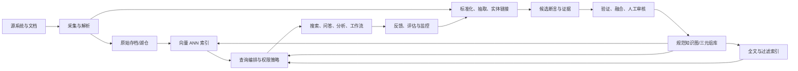

# 14 Knowledge Engine 蓝图

## 1. 定义与边界

这里的 Knowledge Engine 是将异构资料转成**带身份、语义、证据、权限和时间边界的可查询知识**，再供搜索、问答、分析和工作流调用的系统。它不是单一数据库，也不是只调用 LLM 的聊天界面。

## 2. 参考架构



其中 `C` 和 `G` 是需要备份、版本和访问控制的持久知识层；`H`、`I` 是可从持久层重建的派生加速层。候选断言 `E` 是模型与人工协作的缓冲区，不能绕过验证直接进入规范图。

## 3. 写路径：从原文到可发布事实

1. 为输入分配不可变 `sourceRecordId`，保留内容哈希、来源系统、获取时间和访问级别。
2. 解析为结构化记录与可定位的证据片段（文档版本、段落/页码/字符偏移）。
3. 抽取实体、关系和属性，生成候选而非事实。
4. 以 ID、规则、候选索引和审核进行实体链接；保留合并历史。
5. 用 SHACL/业务规则验证，再按来源与时间策略融合。
6. 发布 canonical version，并异步或受控地更新全文、向量和图加速索引。

每一步都写入 `pipelineRunId`、输入/输出版本、代码/模型版本和状态。这样“某答案为什么变化”可以回答为明确的变更链，而不是猜测。

## 4. 读路径：从问题到证据

```text
认证与授权
  → 意图/实体解析
  → 按权限过滤的 lexical + vector 召回
  → 图约束、关系扩展、规则验证
  → 融合重排与证据选择
  → 结构化结果或带引用的自然语言响应
```

服务响应推荐包含：`answer`、`entities`、`facts/paths`、`evidence`、`graphVersion`、`indexVersion`、`retrievalTrace` 和 `confidence/abstainReason`。将“没有足够证据”建成合法响应，而不是强迫系统给出流畅猜测。

## 5. 数据库和索引组合建议

| 需求 | 主组件 | 索引策略 |
| --- | --- | --- |
| 标准 RDF 与跨域语义 | Jena/Fuseki 或其他三元组库 | 三元组排列、命名图过滤、SPARQL 统计 |
| 事务型业务图与路径 | Neo4j 等属性图 | 唯一/范围/文本、邻接遍历、受控路径 |
| 大规模分布式属性图 | JanusGraph + 存储/搜索后端 | 复合索引、混合索引、顶点中心索引、分区 |
| 文本和过滤召回 | OpenSearch 类系统 | 语言分析器、倒排、字段与 ACL 过滤 |
| 语义近邻 | 向量索引/数据库 | HNSW/IVF 等 ANN、维度与元数据过滤 |

不要因为“一个数据库支持多种索引”就忽略各自的运维边界。权威写入路径、索引异步程度、版本切换和故障降级必须在架构评审中被明确。

## 6. 上线 SLO 与指标

| 层 | 指标示例 |
| --- | --- |
| 摄取 | 成功率、延迟、重复率、解析失败原因 |
| 质量 | SHACL 违规、链接精确率、可追溯断言比例 |
| 索引 | 构建滞后、在线率、索引大小、召回抽样 |
| 查询 | p50/p95/p99、超时率、计划退化、候选量 |
| 任务效果 | Recall@k、引用正确率、用户采纳/纠错率 |
| 安全 | 权限过滤命中、越权尝试、删除传播时延 |

节点数、边数和 embedding 数量可作为容量指标，却不是价值指标。

## 7. 90 天渐进式落地

| 阶段 | 时间 | 交付与退出条件 |
| --- | --- | --- |
| 发现 | 第 1–2 周 | 一个决策用例、10 个查询模板、数据分类和指标基线 |
| MVP | 第 3–6 周 | 一个源、最小模式、证据链、质量检查、只读 API |
| 评估 | 第 7–9 周 | 标注集、检索/引用评估、权限与负载测试、回滚演练 |
| 扩展 | 第 10–13 周 | 第二数据源、变更处理、索引蓝绿切换、运营看板 |

每阶段若不能提升目标任务或无法维持证据/权限契约，应缩小范围修复，不应用更多数据掩盖问题。

