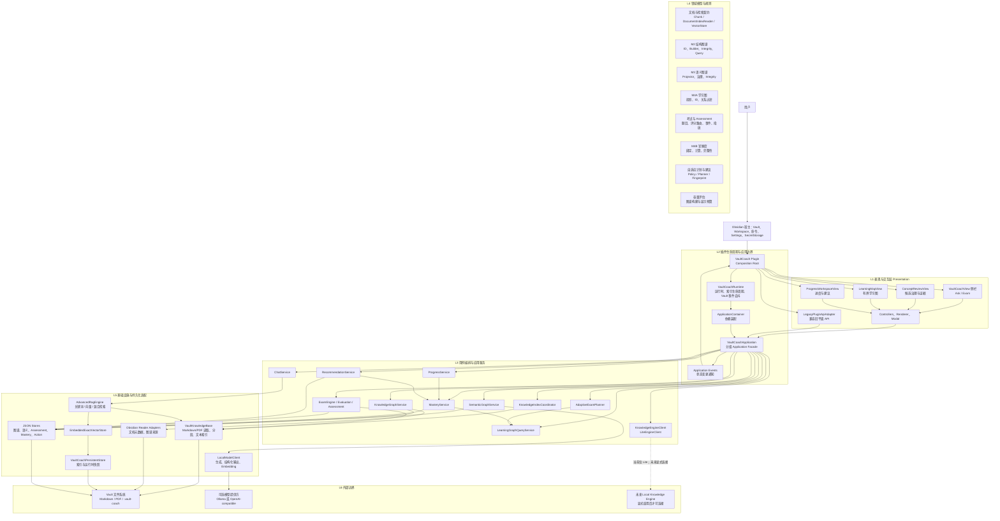
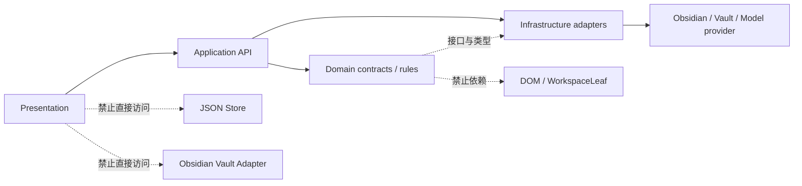
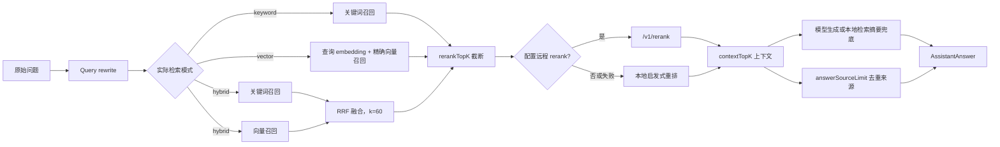
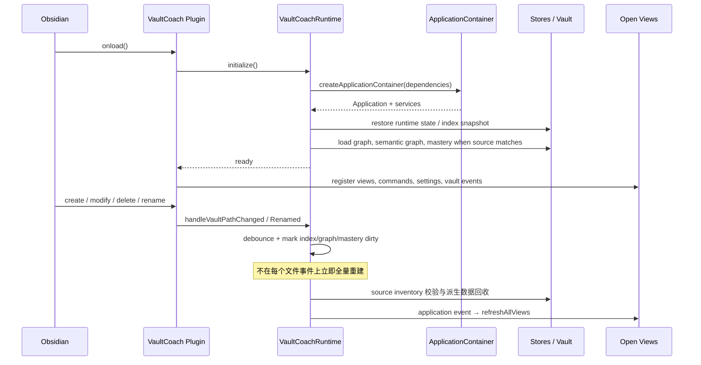
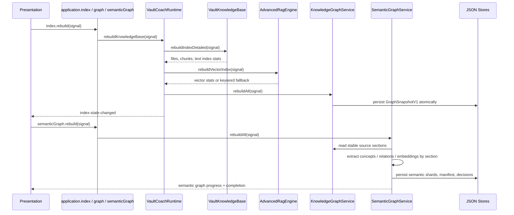
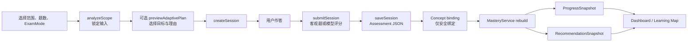
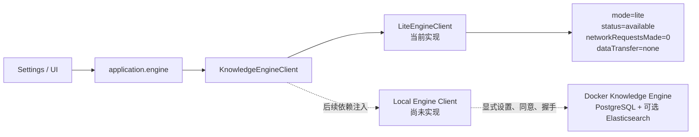

---
tags:
  - VaultCoach
  - 架构
  - Obsidian插件
  - KnowledgeGraph
  - KnowledgeEngine
status: current-implementation
updated: 2026-10-04
code-version: 1.4.1
source-of-truth:
  - src/vault-coach-plugin.ts
  - src/app/application-api.ts
  - src/app/application-container.ts
  - src/app/vault-coach-runtime.ts
  - src/app/vault-coach-application.ts
related:
  - 开发规划与过程记录/里程碑0-第二轮架构重构开发文档.md
  - 开发规划与过程记录/里程碑8-Lite发布加固与KnowledgeEngine接缝开发记录.md
  - ../knowledge-engine/01-需求规格.md
  - ../knowledge-engine/02-架构设计.md
---

# Vault Coach 当前详细架构总览

> 本文描述的是 2026-10-04 工作区中已经存在的 Vault Coach 1.4.1 Lite 架构。内容以源码和测试为准，不把路线图当作已实现功能。Knowledge Engine 目前只有本地 Lite 回退实现与协议接缝；尚未连接 Docker、PostgreSQL 或 Elasticsearch 服务。

![[Pasted image 20261009131520.png]]

**新人可以这样读这张图**

- 想改界面：看 L1，然后只通过 L2 的 Facade 调用能力。
- 想加功能：先在 Facade（`src/app/application-api.ts`）定义用例，再到 `application-container.ts` 里装配实现。
- 想改算法或规则：看 L4，这一层不依赖 Obsidian，最容易写单测。
- 想接新存储或新模型：在 L5 实现 L4 定义的接口。图里 L4 和 L5 之间的向上箭头就是这个意思，也是最容易被新人看反的地方。
- 紫色的 Facade 是唯一入口，teal 色的 L4 是纯规则层，虚线框表示兼容层（Legacy API）或尚未接入的部分（Knowledge Engine）。
## 0. 给新贡献者的快速入口

第一次接触项目时，建议按下面的顺序阅读和验证：

1. 阅读 `src/main.ts` 和 `src/vault-coach-plugin.ts`，了解 Obsidian 如何加载插件、注册视图和命令；
2. 阅读 `src/app/application-api.ts`，把它视为表现层可调用能力的目录；
3. 阅读 `src/app/application-container.ts`，确认每个接口当前绑定到哪个具体实现；
4. 阅读 `src/app/vault-coach-runtime.ts`，理解索引、恢复、自动同步、取消和 dirty 状态；
5. 根据功能进入 `src/domain/<feature>/`、`src/app/<feature>/` 和 `src/infrastructure/`；
6. 修改代码前运行 `npm test` 和 `npm run build`，建立本地基线；
7. 修改后至少运行受影响测试、`npm test`、`npm run build`。若改动 UI，再在 Obsidian 中手工验证视图、命令、取消和插件卸载。

本文使用以下状态词：

| 标记       | 含义                            |
| -------- | ----------------------------- |
| **已实现**  | 当前 1.4.1 源码存在且由容器装配或 UI 调用    |
| **兼容层**  | 为渐进重构保留，新增代码不应继续扩大依赖面         |
| **协议接缝** | 类型和默认实现已经存在，但外部服务实现尚未接入       |
| **保留类型** | DTO 已允许某种值，但当前没有对应读取器、命令或完整用例 |
|          |                               |

### 0.1 当前技术基线

| 项目             | 当前值                                                                               |
| -------------- | --------------------------------------------------------------------------------- |
| 插件版本           | `1.4.1`                                                                           |
| 最低 Obsidian 版本 | `1.11.4`                                                                          |
| 桌面限定           | `false`，代码仍需关注移动端内存、PDF 和本地模型可达性                                                  |
| 语言             | TypeScript；开启 `noImplicitAny`、`strictNullChecks`、`noUncheckedIndexedAccess` 等严格检查 |
| 构建             | esbuild，入口 `src/main.ts`，输出根目录 `main.js`                                          |
| 测试             | Vitest                                                                            |
| 包管理器           | npm                                                                               |
| 运行依赖           | `pdfjs-dist`；Obsidian API 由宿主提供并在打包时 external                                     |
| 默认模型           | Ollama：聊天 `gemma3:4b`，embedding `embeddinggemma`                                  |
| 默认检索           | hybrid；向量启用；query rewrite 启用；本地启发式 rerank 可用                                      |
| 默认文档           | Markdown 启用；PDF 关闭，需用户显式开启                                                        |
| 默认语义图谱         | 关闭，需用户显式开启并手工触发首次构建                                                               |

## 1. 架构目标与阅读约定

Vault Coach 是一个运行在 Obsidian 中的本地优先学习插件。它把用户 Vault 中的 Markdown/PDF 转成可检索的语义窗口（chunk），在此基础上提供带证据的对话、考试、确定性结构图谱、语义概念图谱、学习图、掌握度和复习建议。

架构的主约束如下：

1. **Vault 是源事实**：原始 Markdown/PDF、用户人工维护的笔记链接和 Assessment Session 是事实来源；索引、图谱快照、掌握度和建议均可再生。
2. **本地优先**：Lite 的索引、图谱、考试记录均在 Vault 内保存。只有用户配置模型提供方时，模型请求才可能发往 Ollama 或用户填写的 OpenAI-compatible 端点。
3. **单向依赖**：Presentation 调用 Application API；Application 编排用例；Domain 定义规则和契约；Infrastructure 实现 Obsidian、文件和存储适配。视图不直接读写 JSON Store。
4. **证据与治理分离**：M2 结构图谱记录可复现的文档结构事实；M3 语义图谱的候选、确认、拒绝、合并和手工关系单独保存。M3 决策不反写 M2。
5. **考试模式不等于能力事实**：`simple | challenge` 影响本场题型及评分路径；不能改变图谱事实、掌握度权重或推荐排序。

下文中的标记含义：**已实现**表示当前 Lite 已有可调用代码；**兼容层**表示重构过渡代码；**接缝**表示已定义接口但没有远程服务实现。

## 2. 总体分层图



### 2.1 依赖方向与禁止路径



- `Presentation` 只通过 `VaultCoachApplicationApi` 读取状态和执行用例；不能因按钮点击而直接改写图谱、掌握度或 Store。
- `Domain` 不依赖 Obsidian、DOM、网络实现；它只定义类型、规则、完整性校验和端口。
- `Infrastructure` 可以依赖 Obsidian 的 `App`、`VaultAdapter`，也可以实现 Domain port。
- `VaultCoach` 插件类是宿主适配与装配根；它保留了一部分历史 UI API，正由 `LegacyPluginApiAdapter` 逐步迁移到 Application Facade。

## 3. 各层模块、职责与接口

| 层次       | 已实现模块                                                                                              | 核心职责                                               | 对外接口 / 输入输出                                                                                      | 依赖约束                                  |
| -------- | -------------------------------------------------------------------------------------------------- | -------------------------------------------------- | ------------------------------------------------------------------------------------------------ | ------------------------------------- |
| L0 宿主    | `VaultCoach`、commands、ribbon、`VaultCoachSettingTab`                                                | 插件 `onload/onunload`、注册 View Type、命令、设置页和 Vault 事件 | Obsidian `Plugin`、`App`、`WorkspaceLeaf`、`Notice`                                                 | 只做装配和宿主桥接，不放业务规则                      |
| L1 表现    | `VaultCoachView`、Chat/Exam/Concept Review/Learning Map/Progress View；controllers、components、modals | 渲染状态、收集输入、显示进度/错误、打开证据文件                           | 消费 `VaultCoachApplicationApi`；Controller 返回 View Model 或调用受限 use case                            | 不读取 `.vault-coach`，不直接构造领域快照          |
| L1 兼容    | `LegacyPluginApiAdapter`、`presentation/plugin-api.ts`                                              | 将旧的扁平插件 API 逐步代理到新的分组 Facade                       | `VaultCoachPluginApi` → `application.chat/exam/index`                                            | 过渡层；新代码优先直接依赖 Facade                  |
| L2 运行时   | `VaultCoachRuntime`                                                                                | 管理 dirty 状态、索引中止、Vault 变更去抖、来源 inventory、恢复/回收派生数据 | `rebuildKnowledgeBase`、`clearKnowledgeIndex`、`ensureKnowledgeBaseReady`、`handleVaultPathChanged` | 不持有 View / DOM；向宿主发送刷新回调              |
| L2 应用边界  | `ApplicationContainer`、`VaultCoachApplication`、`application-events.ts`                             | 组装唯一服务实例；将用例分组暴露；在事实变化后使派生读取失效并通知 UI               | `VaultCoachApplicationApi`、`subscribe(listener)`                                                 | Presentation 不能绕过这层访问 service / store |
| L3 应用服务  | Chat、Index、Graph、Semantic Graph、Learning Graph、Exam、Mastery、Progress、Recommendation、Engine         | 编排一次用户动作所需的依赖、事务顺序、错误/取消和缓存失效                      | 见第 4 节 Facade；服务输出领域 DTO / Snapshot                                                              | 不把 UI 状态写成领域事实                        |
| L4 领域    | `src/domain/**`                                                                                    | 定义稳定 ID、数据契约、纯计算、排序、指纹、完整性规则和容量策略                  | `GraphSnapshotV1`、`SemanticGraphState`、`MasterySnapshotV1`、`ExamPlan`、`RecommendationSnapshot` 等 | 不依赖 Obsidian API、网络或 JSON 文件          |
| L5 内容与检索 | `VaultKnowledgeBase`、`AdvancedRagEngine`、`EmbeddedExactVectorStore`、`LongTermMemoryService`        | 解析 Markdown/PDF、构造 chunk、关键词/向量检索、证据引用、会话记忆        | `DocumentIndexReader`、`VectorStore`、`AssistantAnswer`                                            | 本地索引是派生数据，原文仍在 Vault                  |
| L5 适配与存储 | Obsidian reader adapters、JSON Store、`VaultCoachPersistentStore`、`StorageFootprintReporter`         | 把 Domain port 落到 Obsidian Vault；原子读写、恢复、体积统计       | `GraphStore`、`SemanticGraphStore`、`AssessmentSessionStore` 等                                     | 文件格式必须有 schema version 且可校验           |
| L6 外部边界  | 可选模型端点；`KnowledgeEngineClient` 接缝                                                                  | 模型生成/embedding；未来本地 Engine 健康检查和能力协商               | 模型调用；`getAvailability/getDiagnostics/refresh`                                                    | 无用户明确配置不得联网；Lite Engine 不发网络请求        |

### 3.1 源码目录与所有权

```text
src/
├── main.ts                         # 极薄入口，只默认导出插件类
├── vault-coach-plugin.ts           # Obsidian composition root 与宿主桥接
├── constants.ts                    # 稳定 View ID、默认值、持久化路径
├── settings.ts                     # 设置 UI、校验、保存和索引失效触发
├── i18n.ts                         # 用户可见文案和翻译键
├── app/
│   ├── application-api.ts          # 表现层业务接口
│   ├── application-events.ts       # 进程内状态变更事件
│   ├── application-container.ts    # 唯一依赖装配点
│   ├── vault-coach-application.ts  # Facade 实现、事务顺序和失效传播
│   ├── vault-coach-runtime.ts      # 索引生命周期、恢复、Vault 事件
│   └── <feature>/                  # 应用服务：chat/index/graph/semantic/... 
├── domain/<feature>/               # 纯类型、端口、算法、策略、完整性校验
├── infrastructure/
│   ├── obsidian/                   # Obsidian-backed reader adapters
│   └── storage/                    # JSON/二进制 Store 与磁盘统计
├── presentation/
│   ├── components/                 # 可复用渲染组件和纯 View Model
│   ├── controllers/                # UI 状态机与 Application API 调用
│   ├── modals/                     # 对话框
│   ├── views/                      # 工作区 ItemView
│   └── legacy-plugin-api-adapter.ts
├── plugin/                         # 命令、ribbon、workspace helper
├── exam/                           # 历史路径中的考试应用实现
├── parsers/                        # Markdown/PDF 解析
├── knowledge-base.ts               # 历史路径中的本地文档索引实现
├── rag-engine.ts                   # 历史路径中的 RAG 编排实现
├── model-client.ts                 # 模型、embedding、rerank 传输适配
└── vector-store.ts                 # 嵌入式精确向量库
```

`knowledge-base.ts`、`rag-engine.ts`、`model-client.ts`、`settings.ts` 和部分考试文件较大，是历史演进形成的热点。贡献者应把新增独立能力放入有单一职责的新模块，而不是继续扩大这些文件。除非任务本身是重构，功能 PR 不应顺手大规模移动旧代码，以免同时引入行为变化和路径变化。

### 3.2 三类接口的区别

| 接口类别 | 例子 | 谁可以依赖 | 稳定性要求 |
| --- | --- | --- | --- |
| Application Facade | `VaultCoachApplicationApi` | 新 View、Controller、Modal | 当前进程内的首选业务边界；改签名时同步全部调用方和测试 |
| Domain port | `DocumentIndexReader`、`VectorStore`、`GraphStore`、`AssessmentSessionStore` | 应用服务与基础设施实现 | 应保持窄接口，不能泄漏 Obsidian、DOM 或具体 JSON 路径 |
| 兼容 UI API | `VaultCoachPluginApi`、`LegacyPluginApiAdapter` | 旧 Chat/Exam/Settings 代码 | 只为迁移保留；新功能不要增加新的扁平代理方法 |

这里的 Application Facade 是插件内部 TypeScript 契约，不是向其他 Obsidian 插件承诺的公共 npm API。稳定命令 ID、View Type 和磁盘 schema 的兼容成本更高，不能随意改名。

### 3.3 当前依赖装配清单

`createApplicationContainer()` 是回答“某个 port 当前由谁实现”的唯一首选位置：

| 抽象/能力 | 当前具体实现 | 关键依赖 |
| --- | --- | --- |
| 文档索引 | `VaultKnowledgeBase` | Obsidian `App`、动态 settings |
| 向量存储 | `EmbeddedExactVectorStore` | `VaultCoachPersistentStore` |
| RAG | `AdvancedRagEngine` | Document index、VectorStore、settings、runtime retrieval mode、secret getter |
| Chat | `ChatService` | RAG、Memory、ensure-ready、persist callback |
| Memory | `LongTermMemoryService` | settings、conversation reader、RAG |
| 模型 | `LocalModelClient` | settings、SecretStorage getter |
| 评分路由 | `ExamEvaluationRouter` | 模型自由回答 evaluator + 确定性客观题 evaluator |
| M2 | `KnowledgeGraphService` | Obsidian source reader、deterministic builder、JSON graph store |
| M3 | `SemanticGraphService` | M2、DocumentIndexReader、semantic store、extraction/model/embedding gateway |
| M4A | `LearningGraphQueryService` | `ServiceLearningGraphSource(M2, M3)` |
| Exam | `ExamEngine` | App、DocumentIndex、file metadata reader、settings/model、chunk→concept mapping |
| Assessment | `JsonAssessmentSessionStore` | Vault adapter |
| Mastery | `MasteryService` | Assessment store、Learning Graph catalog、Mastery store、capacity reader |
| Recommendation | `RecommendationService` | Learning Graph、Mastery、review action store |
| Progress | `ProgressService` | catalog、Mastery、Assessment store、Recommendation |
| Adaptive Exam | `AdaptiveExamPlanner` | Learning Graph、Mastery、Assessment store |
| Engine | `LiteEngineClient` | 无网络、无外部进程 |
| Application | `VaultCoachApplication` | 以上服务与 Runtime callbacks |

容器通过 callback 读取最新 settings，而不是在构造时复制一份设置快照。新增 Service 若缓存设置派生结果，必须定义哪些字段变化会使 cache 失效。

## 4. Application Facade：表现层唯一业务入口

`src/app/application-api.ts` 定义 `VaultCoachApplicationApi`。它按能力分组，而非按 View 分组，因此新的界面可以复用同一个用例边界。

| 子 API | 主要方法 | 输入 → 输出 | 功能与状态影响 |
| --- | --- | --- | --- |
| `chat` | `getMessages`、`appendUserMessage`、`streamAssistantTurn`、`resetConversation` | 文本、可选流式 handler → `AssistantAnswer` | 通过 RAG 生成带 `AnswerSource` 的回答；完成后发出 `conversation-changed` |
| `exam` | `getScopeOptions`、`analyzeScope`、`previewAdaptivePlan`、`createSession`、`submitSession`、`saveSession`、`exportSession`、history CRUD | `ExamScopeSelection`、`ExamGenerationOptions`、作答 → `ExamSession` / `AdaptiveExamPlanResult` | 分析阶段锁定范围和 `ExamMode`；评分后保存 Assessment 证据，再使 mastery/progress/recommendation 失效 |
| `index` | `rebuild`、`clear`、`abort`、`getState`、`getStorageFootprint` | 可选 `AbortSignal` → 索引状态 / 存储统计 | 重建文本、向量和确定性图谱；状态包含 dirty、来源 inventory、busy、chunk/vector 统计 |
| `graph` | `rebuild`、`getSnapshot`、`getNode`、按文件/节点查边、`getEdgeSources`、`checkIntegrity` | node/edge/file ID → M2 graph DTO | 管理确定性结构图谱；重建后使 Learning Graph、Mastery、Progress 失效 |
| `semanticGraph` | `rebuild`、`clear`、`abort`、`getReviewProjection`、确认/拒绝/合并/alias/手工关系及撤销 | candidate fingerprint、concept ID、evidence → semantic projection/state | 管理 M3 抽取事实和用户治理决策；只改变 effective Concept 投影，不改 M2 事实 |
| `learningGraph` | `getProjection`、`getConceptCatalog` | `LearningGraphQuery` → 有界投影 / catalog | 只读组合 M2 和有效 M3，用于 Learning Map、Mastery、Planner；不暴露 Store |
| `mastery` | `getState`、`getSnapshot`、`getConceptState`、`rebuild`、`clear` | concept ID → `ConceptMasteryState` / snapshot | 基于 Assessment 事件和 effective Concept 计算可追溯掌握度；dirty 时必须显式重算 |
| `progress` | `isAvailable`、`getState`、`getSnapshot` | 无 → `ProgressSnapshot` | 聚合图谱、掌握度、Assessment 和建议，供 Dashboard 只读展示 |
| `recommendations` | `isAvailable`、`getSnapshot`、`recordAction`、`exportMarkdown` | recommendation ID、`ReviewAction` → snapshot / Markdown | 产生有限、可解释、可丢弃的复习队列；仅持久化用户对建议的动作日志 |
| `engine` | `getAvailability`、`getDiagnostics`、`refresh` | 可选 `AbortSignal` → Engine availability | 目前返回 Lite 本地状态及零网络诊断；保留未来 Local Engine 接入位置 |

### 4.1 完整 Facade 方法签名

下面是当前 `src/app/application-api.ts` 的调用面。贡献者应在这里新增用例级方法，避免让 UI 获得整个 Service 或 Store。

```ts
interface VaultCoachApplicationApi {
  chat: {
    getMessages(): readonly ChatMessage[];
    appendUserMessage(text: string): Promise<void>;
    streamAssistantTurn(text: string, handlers?: StreamHandlers): Promise<AssistantAnswer>;
    resetConversation(): void;
  };

  exam: {
    getScopeOptions(): ExamScopeOption[];
    getFileOptions(folderPaths: string[]): ExamFileOption[];
    getScopeSnapshot(selection: ExamScopeSelection): ExamScopeSnapshot;
    analyzeScope(selection: ExamScopeSelection, options?: ExamGenerationOptions): Promise<ExamScopeAnalysisResult>;
    previewAdaptivePlan(request: AdaptiveExamPlanRequest): Promise<AdaptiveExamPlanResult>;
    createSession(selection: ExamScopeSelection, count: number, options?: ExamGenerationOptions): Promise<ExamSession>;
    submitSession(session: ExamSession, answers: string[]): Promise<ExamSession>;
    saveSession(session: ExamSession): Promise<ExamSession>;
    exportSession(session: ExamSession, folderPath: string): Promise<string>;
    listHistory(): Promise<ExamHistoryItem[]>;
    readHistory(path: string): Promise<string>;
    deleteSession(session: ExamSession): Promise<void>;
    deleteHistory(path: string): Promise<void>;
  };

  index: {
    rebuild(signal?: AbortSignal): Promise<void>;
    clear(): Promise<void>;
    abort(): void;
    getState(): KnowledgeIndexViewState;
    getStorageFootprint(): Promise<StorageFootprint>;
  };

  graph: {
    rebuild(signal?: AbortSignal): Promise<GraphSnapshotV1>;
    getSnapshot(): Promise<GraphSnapshotV1 | null>;
    getNode(nodeId: string): Promise<KnowledgeGraphNode | null>;
    findNodesByDocumentPath(filePath: string): Promise<KnowledgeGraphNode[]>;
    findEdgesForNode(nodeId: string): Promise<KnowledgeGraphEdge[]>;
    findEdgesBySourceFile(filePath: string): Promise<KnowledgeGraphEdge[]>;
    getEdgeSources(edgeId: string): Promise<GraphSourceLocation[]>;
    checkIntegrity(): Promise<GraphIntegrityReport>;
  };

  semanticGraph: {
    rebuild(signal?: AbortSignal): Promise<void>;
    clear(): Promise<void>;
    resetGovernanceDecisions(): Promise<void>;
    getGovernanceImpact(): SemanticGovernanceImpact;
    abort(): void;
    getState(): SemanticGraphStateView;
    getReviewProjection(query?: ConceptReviewQuery): Promise<ConceptReviewProjection>;
    confirmCandidate(fingerprint: string): Promise<void>;
    rejectCandidate(fingerprint: string, reason?: string): Promise<void>;
    undoCandidateDecision(decisionId: string): Promise<void>;
    mergeConcepts(canonicalConceptId: string, mergedConceptIds: readonly string[]): Promise<void>;
    undoMerge(decisionId: string): Promise<void>;
    addAlias(conceptId: string, alias: string): Promise<void>;
    removeAlias(conceptId: string, alias: string): Promise<void>;
    createManualRelation(
      type: SemanticRelationType,
      sourceConceptId: string,
      targetConceptId: string,
      evidence?: readonly ConceptEvidenceRef[],
      note?: string,
    ): Promise<void>;
    removeManualRelation(relationId: string): Promise<void>;
    undoManualRelationRemoval(decisionId: string): Promise<void>;
  };

  learningGraph: {
    getProjection(query?: LearningGraphQuery): Promise<LearningGraphProjection>;
    getConceptCatalog(): Promise<LearningGraphConceptCatalog>;
  };

  mastery: {
    getState(): MasteryStateView;
    getSnapshot(): MasterySnapshotV1 | null;
    getConceptState(conceptId: string): ConceptMasteryState | null;
    rebuild(): Promise<MasterySnapshotV1>;
    clear(): Promise<void>;
  };

  progress: {
    isAvailable(): boolean;
    getState(): ProgressStateView;
    getSnapshot(): Promise<ProgressSnapshot>;
  };

  recommendations: {
    isAvailable(): boolean;
    getSnapshot(): Promise<RecommendationSnapshot>;
    recordAction(recommendationId: string, action: ReviewAction, deferUntil?: number): Promise<void>;
    exportMarkdown(): Promise<string>;
  };

  engine: {
    getAvailability(): KnowledgeEngineAvailability;
    getDiagnostics(): KnowledgeEngineDiagnostics;
    refresh(signal?: AbortSignal): Promise<KnowledgeEngineAvailability>;
  };
}
```

Facade 的实现类另外提供生命周期方法：

```ts
subscribe(listener: ApplicationEventListener): () => void;
dispose(): Promise<void>;
```

调用约定：

- 查询方法返回 DTO 或 clone，表现层不应原地修改返回值并期待系统状态变化；
- 执行耗时工作的 API 应接受 `AbortSignal`，或提供明确的 `abort()`；
- 可选服务使用 `isAvailable()` 或返回 unavailable DTO，UI 不应通过捕获空指针判断能力；
- 对象 ID、candidate fingerprint、decision ID、session ID 都是跨调用引用，不要用显示名称代替；
- `saveSession()` 先保存结构化 Assessment 事实，再写 Markdown 投影；派生 Mastery 更新失败不能回滚已经保存的学习证据；
- `exportMarkdown()` 返回字符串，不直接决定保存位置，保持生成和宿主文件交互分离。

### 4.2 应用事件

`VaultCoachApplication.subscribe(listener)` 是 UI 刷新的单一通知通道。当前事件包括：

- `conversation-changed`：消息追加、流式回答完成或重置；
- `index-state-changed`：索引开始、结束、清除或中止；
- `graph-state-changed`、`semantic-graph-state-changed`：图谱或语义治理状态改变；
- `mastery-state-changed`、`exam-history-changed`：Assessment 或掌握度相关数据改变；
- 推荐和进度通过上述事实变化失效并在下次读取时重算，避免每次 Vault 事件全量刷新所有投影。

插件宿主收到通知后调用 `refreshAllViews()`，逐个刷新已打开的 View。Runtime 不直接持有任何 `WorkspaceLeaf`，避免业务运行时和 Obsidian UI 生命周期相互耦合。

当前事件声明及实际用途如下：

| 事件 | 当前触发点 | 必须先完成的失效处理 |
| --- | --- | --- |
| `index-state-changed` | rebuild/clear/abort、IndexCoordinator 状态变化 | Progress 与 Recommendation 标记 dirty；M2/M3 由 Runtime 按构建结果处理 |
| `graph-state-changed` | M2 显式重建完成 | Learning Graph cache 失效、Mastery dirty、Progress/Recommendation dirty |
| `semantic-graph-state-changed` | 构建开始/结束、checkpoint、治理动作、clear/abort | 对有效语义事实的变更还需使 Learning Graph、Mastery、Progress/Recommendation 失效 |
| `mastery-state-changed` | Mastery rebuild/clear、图谱变化、考试保存后的增量计算 | Progress/Recommendation 已在用例中失效 |
| `recommendations-changed` | 用户完成、跳过、恢复或延后建议 | Recommendation 自身和 Progress cache 失效 |
| `conversation-changed` | 用户消息、回答完成、重置 | 无学习事实失效 |
| `exam-history-changed` | 考试保存或删除 | 保存新 Assessment 时会失效学习派生数据；删除路径见第 14 节已知风险 |
| `state-changed` | 已声明的通用事件 | 当前没有明确 emit 点，新增代码不要用它替代更具体事件 |

事件是“需要重新读取状态”的提示，不承载完整状态，也不保证每个中间 token 都触发。View 收到事件后应从 Facade 重新读取所需 DTO。

## 5. 领域模型与关键端口

### 5.1 文档、检索与模型

| 契约 / 实现 | 作用 | 主要接口 | 当前实现 |
| --- | --- | --- | --- |
| `DocumentIndexReader` | 只读文档索引 port | `getAllChunks`、`getChunksByFilePath`、`searchKeyword`、`readDocumentText` | `VaultKnowledgeBase` 提供 Markdown/PDF 的 chunk 与关键词检索 |
| `VectorStore` | 向量索引 port | `initialize`、`upsert`、`search`、`clear`、`getStats` | `EmbeddedExactVectorStore`，Lite 中为嵌入式精确检索 |
| `AdvancedRagEngine` | 检索编排 | keyword/vector/hybrid 检索、重排序、来源封装 | 依赖知识库、VectorStore、设置和模型配置 |
| `AssistantAnswer` / `AnswerSource` | 回答契约 | 文本、来源位置、摘要、实际检索模式、查询改写 | Presentation 用 `AnswerSource` 跳回 Markdown 标题或 PDF 页码 |
| `LocalModelClient` | 模型适配 | Chat、JSON 结构化生成、embedding | 读取用户设置；可使用本地或用户配置的兼容端点 |

#### 5.1.1 `DocumentIndexReader` 与 `VectorStore` 端口

```ts
interface DocumentIndexReader {
  isReady(): boolean;
  getStats(): KnowledgeBaseStats;
  getAllChunks(): IndexedChunk[];
  getChunkById(chunkId: string): IndexedChunk | null;
  getChunksByIds(chunkIds: readonly string[]): IndexedChunk[];
  getChunksByFilePath(filePath: string): IndexedChunk[];
  getFileRecords(): KnowledgeBaseFileRecord[];
  getFileRecord(filePath: string): KnowledgeBaseFileRecord | null;
  readDocumentText(filePath: string): Promise<string | null>;
  searchKeyword(query: string, limit: number): KeywordSearchHit[];
}

interface VectorStore {
  initialize(): Promise<void>;
  upsert(records: VectorRecord[]): Promise<void>;
  remove(chunkIds: string[]): Promise<void>;
  search(queryVector: Float32Array, options: VectorSearchOptions): Promise<VectorStoreHit[]>;
  clear(): Promise<void>;
  getStats(): Promise<VectorStoreStats>;
  close(): Promise<void>;
}
```

`DocumentIndexReader` 是只读端口。构建索引、同步文件和保存 snapshot 属于 Runtime 与 `VaultKnowledgeBase` 的实现职责，不应进入需要读文档的每个领域服务。`VectorStore` 只理解 chunk ID、向量和少量过滤元数据；它不负责生成 embedding，也不理解聊天、考试或图谱。

`KnowledgeDocumentType` 包含 `markdown | pdf | zotero`。当前实际索引入口只装配 Markdown 和可选 PDF；`zotero` 是数据契约中的保留类型，不能据此声称已经支持 Zotero 导入。

#### 5.1.2 当前 RAG 管线



具体行为：

1. `LocalModelClient.rewriteQuery()` 根据设置决定是否改写，并保留 `originalQuery`、`rewrittenQuery` 和 `useRewrite`；
2. Runtime 选择的 `keyword | vector | hybrid` 只是请求模式。向量被关闭或索引未就绪时，实际模式降级为 keyword；
3. keyword 使用本地文本索引；vector 为问题生成 embedding，再调用 `VectorStore.search()`；
4. hybrid 分别召回后按 chunk ID 合并，用 reciprocal rank fusion：`1 / (60 + rank)`，再截断到 `hybridSearchTopK`；
5. 候选先截断到 `rerankTopK`。配置 `rerankBaseUrl` 和 `rerankModel` 时调用远程 rerank；否则使用短语命中、标题命中、token 重叠、向量分数和关键词分数的本地启发式打分；
6. 远程 rerank 失败自动回退本地启发式；向量召回失败自动回退 keyword；
7. 排名前 `contextTopK` 的 chunk 进入回答 prompt，来源按 Markdown 文件+标题或 PDF 文件+页码去重，最多 `answerSourceLimit` 条；
8. 流式生成失败会再尝试非流式生成；模型不可用时返回基于召回结果的 Markdown 摘要，仍保留来源和实际检索模式。

这不是 LightRAG 的实体—关系双层检索实现。当前 Ask 主链是 chunk 级 keyword/vector/hybrid RAG；M2/M3 图谱主要服务 Concept Review、Learning Map、Mastery、Adaptive Exam 和 Recommendation。若未来把图谱加入问答检索，应在 Application/Domain 层定义新的有界 retrieval port，并明确证据回链和回退路径，不应让 `rag-engine.ts` 直接读取语义 JSON shard。

#### 5.1.3 嵌入式向量库的复杂度和替换点

`EmbeddedExactVectorStore` 将向量 L2 归一化为 `Float32Array`，持久化为一个 manifest 和一个二进制 shard。查询向量也归一化，逐条点积得到余弦相似度，并用容量为 K 的小顶堆保留 top K。

- 查询时间近似 `O(N × D)`，其中 N 为向量数、D 为维度；
- 内存主体约为 `N × D × 4` 字节，另加 Map、ID 和元数据开销；
- 全部向量维度必须一致，零向量或维度不一致记录会被跳过；
- Store 是懒加载；manifest/schema/shard 长度不匹配时拒绝使用损坏索引；
- 增量同步只删除 `removedChunkIds` 并为 `changedChunks` 重算 embedding；
- 要切换 ANN 或外部服务，实现 `VectorStore` 并在 `ApplicationContainer` 替换装配即可。不要改变 `AdvancedRagEngine` 对具体后端透明的约束。

### 5.2 图谱、学习与治理

| 子域 | 核心对象 / 服务 | 输入 | 输出与不变量 |
| --- | --- | --- | --- |
| M2 确定性结构图谱 | `DeterministicGraphBuilder`、`KnowledgeGraphService`、`GraphIntegrityService` | Obsidian 文档、标题、链接、block/section 来源 | `GraphSnapshotV1`。节点/边保持稳定 ID，每条边可返回 `GraphSourceLocation` 证据 |
| M3 语义概念图谱 | `ConceptExtractionService`、`SemanticGraphService`、`SemanticGraphProjector`、`ConceptSimilarityIndex` | 以 section/chunk 为单位的抽取输入、embedding、M2 来源 | 候选概念/关系、语义事实、治理决策、有效投影。候选未确认前不能参与高影响学习计算 |
| 治理 | confirm/reject、merge/undo、alias、手工 relation | fingerprint、concept ID、`ConceptEvidenceRef`、备注 | 可撤销的用户决策；M2 结构事实不被改写 |
| M4A 学习图 | `LearningGraphQueryService`、`LearningGraphProjectionService` | M2 + 有效 M3 + query/budget | `LearningGraphProjection` / catalog；只返回预算内的概念和关系，供地图而非无限画布 |
| 容量 | `graph-capacity/*` | chunk 数量、图谱工作量、阈值 | 是否允许本机构建、提示用户、降级策略；不阻断 Chat/Exam |

#### 5.2.1 M2、M3、M4A 的事实边界

| 层 | 可以包含 | 不可以包含 | 主要持久化/缓存 |
| --- | --- | --- | --- |
| M2 确定性结构图谱 | 文档、Section、Tag、显式链接及其 source location | 模型猜测的概念等价、先修、相关关系 | `GraphSnapshotV1` |
| M3 语义概念图谱 | 模型抽取记录、Concept、关系候选、embedding、用户确认/拒绝/合并/alias/手工关系 | 修改原文、覆盖 M2、把未确认候选静默升级为事实 | 语义 shard + manifest + decisions |
| M4A 学习图 | M2 + effective M3 的有界只读投影；可选高置信显示候选 | UI 布局坐标成为领域事实、无限节点投影、反写上游 | 进程内 cache，不单独持久化 |

M2 的 `GraphSourceReader` 由 `ObsidianGraphSourceReader` 实现，`GraphSnapshotBuilder` 由纯函数式的 `DeterministicGraphBuilder` 实现。`KnowledgeGraphService` 负责读取、构建、完整性校验、保存和增量合并。失败时保留上一个有效 snapshot，并把服务标为 dirty，文本索引仍可用。

M3 按 Section 构建模型输入。默认会跳过 Markdown 超过 60,000 字符或 1,500 行、PDF 超过 20 MB 的文件，用户可显式开启 `semanticGraphIncludeLargeFiles`。长 Section 只在 chunk 边界切成受限窗口，避免任意截断破坏来源定位。`semanticGraphMaxSectionsPerRun` 是 durable checkpoint 的批次大小，并非“只处理前 N 个 Section”的总上限。

M4A 有两个不同读模型：

- `getProjection(query)` 返回渲染用的有界图，默认最多 150 个节点、300 条边，硬上限 500 个节点、2,000 条边；
- `getConceptCatalog()` 返回领域计算用的 Concept catalog，不带布局、结构节点和候选，但保留 `sourceChunkIds` 以供 Assessment 安全绑定。

不要把渲染预算误用于领域计算，也不要把无界 catalog 直接交给 Canvas。

#### 5.2.2 语义治理与证据

语义关系必须携带 origin/trust/evidence。用户治理操作通过 append-style decision 表达，并由 projector 计算 effective graph：

- confirm/reject 使用 candidate fingerprint，而非当前数组下标；
- merge 使用 canonical concept ID 与 merged IDs，并保留可撤销 decision；
- alias 只改变有效概念显示与精确匹配，不改变原始抽取记录；
- manual relation 必须明确 source/target/type，可附 `ConceptEvidenceRef` 和 note；
- reset governance 只清空人工决策，不重复抽取，也不删除 source-derived facts/embeddings；
- source reconcile 可以在不调用模型的情况下去掉已失效来源的抽取事实，同时保留可能在未来重新出现的决策审计。

任何高影响学习计算都应读取 effective graph 或 confirmed prerequisite，不能直接消费 pending candidate。Learning Map 可以按设置展示高置信 automatic relation，但 `trust: automatic` 只是显示来源，不能当作已确认学习事实。

#### 5.2.3 Lite 容量策略

当前工作区的主要硬门槛按“语义模型输入窗口数”计算，因为一个窗口至少需要一次抽取请求，通常还伴随关系或 embedding 工作：

| semantic input windows | 等级 | 手工构建 | 自动同步 |
| ---: | --- | --- | --- |
| `0–400` | `local` | 允许 | 允许 |
| `401–650` | `warning` | 用户确认后允许 | 禁止 |
| `>650` | `service-required` | 禁止新的本地语义构建 | 禁止 |

chunk 数、Section 数、索引字节、Concept 数、关系数和原始向量字节仍参与诊断，但当前只产生 warning，不会在 `<=650` 窗口时单独阻止用户确认后的本地构建。容量判断是纯函数 `assessGraphCapacity()`，不执行 Vault IO、模型调用或图遍历。

这些阈值是当前产品策略，不是硬件能力证明。修改阈值时必须同时更新纯领域测试、服务集成测试、Modal 文案、README 和本文，并验证允许/确认/拒绝三个边界值。

### 5.3 考试、Assessment、掌握度和建议

| 子域 | 核心对象 / 服务 | 输入 | 输出与不变量 |
| --- | --- | --- | --- |
| 考试生成 | `ExamEngine`、题目 blueprint、`ExamQuestionPolicy` | 已锁定范围、题数、`ExamGenerationOptions`、可选自适应目标 | `ExamSession`。范围分析后必须返回设置页才能切换 `ExamMode` |
| 评分 | `ExamEvaluationRouter` | Session、用户作答、模型元数据 | simple 客观题走 `ObjectiveExamEvaluationService`；challenge/自由文本可走 `ExamEvaluationService`；二者输出兼容评价结果 |
| 评估事实 | `AssessmentEventFactory`、`AssessmentSessionStore` | 已保存考试、题目目标/概念绑定、评分 | 版本化 Assessment Session；无法安全绑定概念时保留未绑定证据，不能猜测 |
| M4B 掌握度 | `MasteryService`、`MasteryEngine`、`MasteryBindingResolver` | 有效 Concept catalog、Assessment sessions、容量状态 | `MasterySnapshotV1`。只依赖可追溯的 Assessment 和有效 Concept，不将题型难度当作能力权重 |
| 自适应考试 | `AdaptiveExamPlanner`、domain planner/policy/fingerprint | 学习图、掌握度、考试历史、用户选择范围/目标模式/题型模式 | 稳定的 `AdaptiveExamPlanResult`，给出为什么选择某 Concept；计划过期或输入变化时拒绝直接生成 |
| 复习建议 | `RecommendationService`、`RecommendationPlanner`、policy | 学习图、掌握度、行动日志 | `RecommendationSnapshot`，上限明确且可解释；`ReviewAction` 只记录完成/跳过/延后等用户动作 |

#### 5.3.1 Assessment 是学习证据的事实源

已评分考试保存时，Application Facade 先构造并写入：

```ts
interface AssessmentSessionDocumentV1 {
  schemaVersion: 1;
  sessionId: string;
  savedAt: number;
  examSession: ExamSession;
  assessmentEvents: AssessmentEvent[];
  conceptBindings: AssessmentConceptBinding[];
}
```

每个 `AssessmentEvent` 包含 session/question ID、概念和 source chunk、原始/归一化分数、难度、题型、错误代码、证据与评分置信度、时间和 evaluator metadata。重新保存时通过 question/event fingerprint 只补建缺失事件，避免同一答案被重复累计。Markdown 考试报告是可读投影，不是掌握度的事实源。

`AssessmentSessionStore` 的领域端口为：

```ts
interface AssessmentSessionStore {
  save(document: AssessmentSessionDocumentV1): Promise<void>;
  read(sessionId: string): Promise<AssessmentSessionDocumentV1 | null>;
  list(): Promise<AssessmentSessionDocumentV1[]>;
  listHistory(): Promise<AssessmentExamHistoryItem[]>;
  rebuildIndex(): Promise<AssessmentSessionIndexV1>;
}
```

评分路由按 answer form 分派：客观题使用确定性 evaluator，自由回答使用模型 evaluator。两者输出同一种 `ExamEvaluation`，并在事件里记录 evaluator kind/provider/model/prompt version。确定性结果不能伪装成模型结果，模型结果也不能覆盖原始作答。

#### 5.3.2 Mastery、Progress 与 Recommendation

Mastery snapshot 是可重建缓存。算法版本当前为 `mastery/v2`，状态包括 score、confidence、level、trend、assessment count、next review、错误代码和逐事件贡献。绑定只允许直接 concept ID、精确显示名、精确 alias 或 source chunk evidence；歧义和缺失进入 `unboundIssues`，不能通过语义相似度猜一个概念。

Mastery 的增量更新只重算本次 Assessment 明确触及的 Concepts。若容量、catalog 或算法版本不允许安全增量计算，服务保留 Assessment 事实并标记 snapshot dirty，后续可以全量重建。

Progress 是进程内只读聚合，不落盘：

- graph summary 来自有效 Concept catalog；
- mastery summary 区分 `current | stale | missing | calculating | unavailable`；
- coverage 在 catalog 或 snapshot 不可用时为 `null`，不能用 `0` 伪造“覆盖率为零”；
- assessment summary 只读取结构化 Assessment history；
- recommendation preview 是有界投影，建议失败不会遮蔽图谱和 Assessment 事实。

Recommendation snapshot 同样不落盘。系统每次从 catalog、Mastery、confirmed prerequisite 和 action log 重建队列；只持久化 `dismissed | deferred | completed | restored` 事件。这让算法升级可以重算建议，同时保留用户已经采取的动作。

## 6. 关键运行流程

### 6.1 启动、恢复与 Vault 变更



启动恢复的判定顺序很重要：

1. `Plugin.loadData()` 加载设置并与 `createDefaultSettings()` 合并；
2. Runtime 创建 Container，所有具体 Service 和 Store 在此只实例化一次；
3. 恢复消息、长期记忆和 `lastAutoIndexAt`；
4. 读取 `index-snapshot.json`，比较 `settingsSignature` 和当前 source inventory；
5. 如果 scope/解析设置签名不一致，或 Vault 在插件离线期间发生变化，不 hydrate 旧 chunk，并把状态设为 `source-sync-required` 或 `possible-domain-switch`；
6. 只有文本 snapshot 可安全 hydrate 时，才加载 M2、M3 和 Mastery；
7. embedding model signature 或旧 snapshot 版本不匹配时，仅清除向量 Store并标记 vector dirty，文本索引仍可用；
8. 恢复完成后，Plugin 才注册 Views、Commands、Settings 和 Vault events。

Source inventory 解决了“插件关闭期间 Vault 改过，但没有收到 create/modify/delete 事件”的问题。它比较路径、内容/mtime 等 inventory 信息并给出 added/removed/modified/changed ratio。检测到可能切换了整个知识域时，不应默默把旧治理与新语料混为一体；UI 应提示用户检查、重建或重置治理决策。

### 6.2 索引与图谱构建



这里 M2 和 M3 是两条不同的构建链：M2 可以脱离模型重建；M3 使用模型抽取并支持中止、进度和用户治理。M3 重建不会把“模型推断”静默写回原始 Markdown 或 M2 结构图。

### 6.2.1 全量重建的事务顺序与降级

`VaultCoachRuntime.rebuildKnowledgeBase()` 按以下顺序执行：

1. 通过 `KnowledgeIndexCoordinator` 建立唯一 busy operation 和 `AbortSignal`；
2. 重建文本 index，得到 `KnowledgeBaseSyncResult`；
3. 尝试重建向量 index。失败时记录 warning、标记 vector dirty，并继续使用 keyword；
4. 尝试重建 M2。失败时保留文本/向量结果，标记图谱和 Mastery dirty；
5. 当来源状态发生变化且 M2 成功时，M3 只做 source reconcile，不自动触发模型全量抽取，并清除过期 Mastery；
6. 持久化文本 snapshot；只有 M2 成功时才带上可确认的 source inventory；
7. 清理 busy/controller 并通知 UI。

取消全量索引时会清空本次内存文本数据和向量数据，并保持 dirty，防止把半成品当成 ready。图谱 Store 自身使用临时文件/备份，所以中途失败不会替换最后一个有效 snapshot。

### 6.2.2 Vault 事件与增量同步

只处理设置允许的 `.md`/`.pdf`，并始终忽略 `.vault-coach/`，否则插件写自己的结果会形成索引事件循环。文件变化进入 `pendingChangedKnowledgePaths`：

- 默认 debounce 为 15 秒；
- 默认 max wait 为 120 秒，持续编辑也会最终 flush；
- 待处理文件达到默认阈值 8 时立即 flush；
- rename 额外保存 old→new 链，以迁移未改文件中仍指向旧路径的图谱端点和 evidence；
- 自动同步期间若再次收到变化，新路径留在下一批；
- 文本增量完成后依次同步向量、M2、可选 M3，并分别捕获失败；一个派生层失败不应让已成功的文本索引失效；
- M3 自动同步还要求用户已开启语义图谱、开启 auto sync，并通过 `allowAutomaticSemanticSync` 容量检查。

不要在 Vault event callback 中直接解析文件或调用模型。回调只负责过滤、排队、标记 dirty 和调度。

### 6.3 考试到掌握度和建议的闭环



## 7. 存储架构与数据所有权

所有 Lite 数据都通过当前 Vault 的 Obsidian API 访问，但分为两个存储域：

1. **插件配置目录**：通常是 `.obsidian/plugins/vault-coach/`。保存 Obsidian 管理的设置、会话/记忆、文本 snapshot 和向量 shard；
2. **Vault 隐藏业务目录**：`.vault-coach/`。保存可审计的 Assessment、报告、图谱、治理决策、Mastery 和 review action。

这两个目录不能混写。插件配置目录可能随插件安装/卸载流程变化；`.vault-coach/` 是 Vault 内用户可备份和审计的学习数据。原始 Markdown/PDF 始终是源文档，插件不改写。

```text
Vault/
├── <configDir>/plugins/vault-coach/
│   ├── data.json 或 Obsidian 管理的数据文件       ← Plugin.loadData/saveData 设置
│   ├── runtime-state.json                        ← 对话、长期记忆、lastAutoIndexAt
│   ├── index-snapshot.json                       ← 文本 chunks/files/stats/inventory，当前 version 3
│   └── knowledge-index/vectors/
│       ├── manifest.json                         ← schema、维度、记录顺序、统计
│       └── shard-000001.bin                      ← Float32 向量
├── 用户 Markdown、PDF 与附件                    ← 源事实，不由插件改写
└── .vault-coach/
    ├── exam-content-profiles.json                ← 考试内容分析 cache
    ├── exams/                                    ← 导出的 Markdown 考试报告
    ├── assessments/
    │   ├── sessions/<session-id>.json             ← 已保存考试与 Assessment 证据
    │   └── index-v1.json                          ← Assessment 索引
    ├── graph/
    │   ├── graph-snapshot-v1.json                ← M2 确定性结构图快照
    │   └── semantic/
    │       ├── semantic-manifest-v1.json         ← M3 分片清单
    │       ├── sections/ concepts/ candidates/   ← 抽取的语义事实分片
    │       ├── embeddings/                       ← 语义 embedding 分片
    │       └── decisions-v1.json                 ← 用户治理决策
    ├── mastery/mastery-snapshot-v1.json          ← M4B 可再生掌握度
    └── recommendations/review-actions-v1.json    ← 用户对建议采取的动作
```

| 数据 | 事实归属 | 写入者 | 读取者 | 生命周期 |
| --- | --- | --- | --- | --- |
| Markdown / PDF | 用户 Vault | 用户或 Obsidian | `VaultKnowledgeBase`、M2 source reader | 永久源文档；插件不重写 |
| Settings | 用户配置 | `Plugin.saveData` | Plugin、Runtime、Container services | 跨启动保留；新增字段必须有默认值和兼容读取 |
| 对话与长期记忆 | 用户运行状态 | Chat/Memory → `VaultCoachPersistentStore` | Chat/Memory | 与索引独立；清索引不应顺带删除 |
| 文本 chunk / 关键词索引 / 向量索引 | 可再生索引 | Runtime、KB、RAG、Persistent Store | Chat、Exam、Semantic extraction | 知识域、设置或文件变化后失效/重建；位于插件配置目录 |
| M2 graph snapshot | 可再生结构事实 | `KnowledgeGraphService` → `JsonGraphStore` | M3、Learning Graph、UI | 由当前源文档可重建 |
| M3 抽取、候选、embedding | 可再生模型派生数据 | `SemanticGraphService` → `JsonSemanticGraphStore` | Learning Graph、Review UI | 对 source inventory/input hash/model signature 对齐 |
| M3 governance decisions | 用户决策事实 | Semantic Facade → `JsonSemanticGraphStore` | Semantic projector、Learning Graph | 只能显式 reset/undo；普通重建不能静默丢失 |
| Assessment sessions | 用户学习证据 | Exam Application API → `JsonAssessmentSessionStore` | Mastery、Progress、Adaptive planner | 用户可查看、导出、删除；不可由推荐直接伪造 |
| Mastery snapshot | 可再生派生缓存 | `MasteryService` → `JsonMasteryStore` | Dashboard、Map、Exam planner | 算法或上游事实变化后 dirty/重建 |
| Progress / Recommendation snapshot | 进程内派生读模型 | 对应 Service | Dashboard、Map | 不持久化；上游变化后失效并懒重算 |
| Review actions | 用户意图记录 | `RecommendationService` → `JsonReviewActionStore` | Recommendation / Progress | 与推荐本身分离；建议可重算，动作可保留 |

### 7.1 写入、校验与恢复保证

不能笼统地认为所有 JSON 写入都具有同一种原子性。当前实现分级如下：

| Store | 当前保证 | 贡献者注意事项 |
| --- | --- | --- |
| Graph | schema + integrity；写 `.tmp`，读回校验，保留 `.bak`，失败恢复 | 新字段必须更新 type、integrity、clone/query 和 Store 测试 |
| Semantic graph | shard 原子替换；manifest 最后提交；schema + integrity；旧 shard 回收 | manifest 必须只指向完整 shard 集，不能先提交 manifest |
| Assessment | session/index schema 校验；`.tmp/.bak`；启动恢复；ID/path 校验 | Assessment JSON 是事实，Markdown 投影失败不能毁掉 JSON |
| Mastery | schema + algorithm version + integrity；`.tmp/.bak` 恢复 | 旧算法 snapshot 应标 dirty 或拒绝，不做静默字段猜测 |
| Vector | 先写 binary shard，再写 manifest；启动校验 schema/维度/长度 | 它是派生数据，损坏时清除并重建即可 |
| Runtime/index snapshot | JSON parse 容错，当前为直接覆盖写 | 不能存不可丢失的唯一事实；新关键事实应使用独立 versioned Store |
| Review actions | schema 和逐事件校验，当前为 read-modify-write 直接覆盖 | 事件量小但写入保证较弱；并发/崩溃安全增强应优先于扩大用途 |

`StorageFootprintReporter` 只扫描已知的 Vault Coach 路径，按 text index、vector index、M2、M3 facts、M3 embeddings、Mastery、review actions、Assessments 和 reports 分类统计 bytes/file count/mtime；它不会遍历任意用户目录。Runtime 会补充可低成本获得的 record count。

### 7.2 Schema 演进规则

持久化结构变化必须选择一种明确策略：

1. **兼容增加**：字段可选，并有确定性默认语义；旧文件可以直接读；
2. **迁移**：提供从旧 schema 到新 schema 的纯迁移和 fixture 测试；
3. **拒绝并重建**：只适用于明确可再生数据，如向量或 Mastery cache；
4. **拒绝并提示人工处理**：适用于无法安全推断的用户事实。

不得用 TypeScript 类型断言替代运行时校验。schema version 是磁盘协议的一部分；更新常量但不更新完整性检查、Store、fixtures 和恢复测试会造成不可见的数据损坏风险。

## 8. Knowledge Engine 接缝：当前实现与未来边界



当前 `KnowledgeEngineApplicationApi` 只读暴露以下协议：

```ts
interface KnowledgeEngineApplicationApi {
  getAvailability(): KnowledgeEngineAvailability;
  getDiagnostics(): KnowledgeEngineDiagnostics;
  refresh(signal?: AbortSignal): Promise<KnowledgeEngineAvailability>;
}
```

这条边界的目的不是让插件现在依赖后端，而是保证将来扩展时仍满足以下条件：

1. Lite 的聊天、考试、本地图谱、掌握度和本地数据不以 Engine 可用为前提；
2. Presentation 不得直接请求任意 URL，也不得把整个 Vault 交给未知服务；
3. Local client 必须在明确的设置、回环地址校验、用户授权、协议版本与 capability 协商完成后才创建；
4. Engine 以 revisioned sync、bounded retrieval、bounded graph projection、durable jobs、knowledge profile 等能力逐步替代部分重计算，而非替代 Vault 中的源事实。

更完整的服务端需求和 PostgreSQL / Elasticsearch 分层见 `kb/knowledge-engine/` 下的需求、架构和检索加速层文档。

## 9. 当前重构状态、风险与演进规则

### 9.1 已有的过渡边界

当前项目已经具备清晰的目标依赖方向，但仍处于渐进重构期：

- `VaultCoach` 仍实现 `LegacyPluginApiHost`，部分旧侧栏/设置操作会经 `LegacyPluginApiAdapter` 转发；新功能应直接使用 `VaultCoachApplicationApi`。
- `src/knowledge-base.ts`、`src/rag-engine.ts`、`src/exam/` 和 `src/model-client.ts` 位于较早的顶层模块路径；它们已经被 `ApplicationContainer` 装配，但尚未全部迁入 `src/app/` 或 `src/infrastructure/`。
- `ApplicationContainerServices` 仅供旧插件适配和运行时使用；它不是 Presentation 的公开 service locator。

这不是让新代码绕过边界的理由。新增功能应先定义 Domain 类型/port，再在 Application Facade 加用例，最后由 Presentation 调用该 Facade。

### 9.2 必须保持的架构不变量

| 变化类型 | 必须保持 | 推荐落点 |
| --- | --- | --- |
| 新 UI | 不直接访问 Vault/JSON，不把 DOM 状态写成事实 | `presentation/controllers` + `VaultCoachApplicationApi` |
| 新学习算法 | 输入可追溯、结果可重算、无 Obsidian 依赖 | `src/domain/<feature>/` |
| 新文件格式 | schema version、输入校验、原子写入/恢复、体积统计 | `src/infrastructure/storage/` |
| 新模型能力 | 最小化范围、明确外发、失败降级、不把模型输出直接当事实 | model gateway + 应用服务 + semantic governance |
| 新图谱关系 | 说明是 M2 结构事实还是 M3 语义/人工关系，并维持 evidence | graph / semantic graph domain 与对应 store |
| 新考试模式 | 不能改变既有评分含义、Assessment 事实或 Mastery 权重 | exam domain + evaluator router + session contract |
| 新 Engine 能力 | Lite 离线可用、显式同意、版本/能力协商、可回退 | `app/engine` port + Local client 实现 |

## 10. UI、View 与命令契约

### 10.1 View Type

| View | 稳定 Type ID | 打开位置 | 主要依赖 |
| --- | --- | --- | --- |
| Ask / Exam | `value-coach-view` | 右侧栏 | Application Facade + `LegacyPluginApiAdapter` |
| Concept Review | `vault-coach-concept-review` | 普通 workspace tab | `semanticGraph` |
| Learning Map | `vault-coach-learning-map` | 普通 workspace tab | `learningGraph`，宿主 callback 负责打开来源/启动考试 |
| Learning dashboard | `vault-coach-progress` | 普通 workspace tab | `progress` + `recommendations` |

`value-coach-view` 中的 `value` 是已发布历史 ID。即使它看起来像拼写错误，也不能直接改成新的字符串，否则 Obsidian 无法恢复已有 workspace leaf。需要迁移时，应先支持旧 ID 并设计显式兼容过程。

主工作区 View 统一通过 `activateMainWorkspaceView()` 创建可关闭、可拆分的 leaf；Ask/Exam 使用 `getRightLeaf(false)`。Domain/Application 不知道 leaf 放在哪里。

### 10.2 稳定命令 ID

| Command ID | 用途 |
| --- | --- |
| `open-view` | 打开 Ask/Exam 侧栏 |
| `reset-conversation` | 重置对话 |
| `rebuild-knowledge-index` | 全量重建文本、向量和 M2 主链 |
| `stop-knowledge-index` | 请求取消当前索引工作 |
| `clear-knowledge-index` | 清除索引和相关可再生派生数据 |
| `open-concept-review` | 打开 Concept Review |
| `open-learning-map` | 打开 Learning Map |
| `rebuild-semantic-concept-graph` | 显式构建 M3，先做容量决策 |
| `reset-semantic-governance-decisions` | 显示影响后清空治理 overlay |
| `show-derived-storage-footprint` | 只读显示派生数据占用 |
| `rebuild-concept-mastery` | 显式重建 Mastery |
| `open-learning-dashboard` | 打开 dashboard |

命令 ID 和 View Type 属于用户 workspace、快捷键和自动化可以引用的兼容契约。显示名称可以本地化，ID 不应随文案重命名。新增命令通过 `this.addCommand()` 注册，用户可见字符串进入 `i18n.ts`。

### 10.3 表现层规则

- View 负责装配 Controller 和组件，不实现检索、评分、图谱合并或 JSON 写入；
- Controller 可以维护临时 UI 状态、调用 Facade、处理 loading/error/cancel，并产出 View Model；
- 组件优先接收 plain DTO 和 callback，便于无 Obsidian 环境的测试；
- 打开 Markdown/PDF 来源由宿主 callback 执行，因为它需要 `Workspace.openLinkText()`；
- 用户可见危险动作使用确认 Modal，并在确认前展示可量化影响；
- 所有 listener/timer/Obsidian event 必须经 `register*` 或在 `onClose/dispose` 中清理；
- 不在 UI 中显示内部 schema、service 名、stack trace 或任意 endpoint 细节，诊断视图除外。

## 11. 设置、模型调用与隐私边界

### 11.1 设置分组与失效范围

| 设置类别 | 代表字段 | 变化后的动作 |
| --- | --- | --- |
| 知识范围/解析 | scope、folder、Markdown/PDF、PDF 限制、chunk size/overlap | text + vector dirty，M2/M3/Mastery 随新来源链路失效 |
| embedding | provider、base URL、model、vector enabled | 清向量 Store，vector dirty；文本索引保留 |
| chat 生成 | provider、chat model、temperature | 影响后续生成，不要求重建文本索引 |
| retrieval | mode、query rewrite、各 TopK、rerank | 影响后续查询；通常不重建现有 index |
| auto sync | enabled、debounce、max wait、file threshold | 影响后续调度，不回放过去事件 |
| semantic graph | opt-in、auto sync、source limit、window/batch/similarity | 影响后续 M3 构建和显示；需要根据语义决定 dirty/rebuild |
| Learning Map automatic | enabled、threshold、rule/similarity | 只影响 display projection，刷新 View，不升级治理事实 |
| memory | enabled、TopK、max items/messages | 影响后续上下文和 trim，不改知识索引 |

新增设置字段时必须同时修改 `VaultCoachSettings`、`createDefaultSettings()`、设置 UI、输入校验、需要的失效调用、i18n 和测试。`Object.assign(defaults, savedSettings)` 只解决字段缺失，不会自动校验旧值的类型或范围。

当前关键默认值：

| 设置 | 默认值 |
| --- | ---: |
| Markdown / PDF indexing | `true` / `false` |
| PDF file/page limit | `50 MB` / `300` |
| chunk size / overlap | `600` / `120` |
| keyword/vector/hybrid TopK | `10` / `10` / `12` |
| rerank/context/source TopK | `8` / `8` / `5` |
| generation temperature | `0.2` |
| long-term memory / memory TopK / max items / max messages | `true` / `4` / `150` / `60` |
| auto sync / debounce / max wait / file threshold | `true` / `15000 ms` / `120000 ms` / `8` |
| semantic enabled / auto sync / include large files | `false` / `false` / `false` |
| semantic checkpoint/window/similarity TopK/threshold | `30` / `9000 chars` / `30` / `0.86` |
| Learning Map automatic relations / threshold | `true` / `0.95` |

默认值集中在 `constants.ts` 与 `createDefaultSettings()`；设置页 fallback 值必须复用相同常量或同步测试，避免首次安装和输入校验得到不同结果。

### 11.2 外部调用会发送什么

| 能力 | 默认目标 | 可能发送的数据 | 触发条件 |
| --- | --- | --- | --- |
| Chat / query rewrite | 本地 Ollama | 当前问题、少量会话、检索上下文、相关记忆 | 用户发起 Ask；provider 可改为 OpenAI-compatible |
| Embedding | 本地 Ollama | chunk/searchable text 或查询文本 | 向量构建/检索已启用 |
| Exam generation/evaluation | 选定 chat provider | 所选 chunk/题目/作答和必要元数据 | 用户生成或提交相应考试 |
| Semantic extraction | 选定 chat/embedding provider | Section excerpt、短 Concept text | 用户显式开启 M3 并构建；默认关闭 |
| Remote rerank | 用户填写的 endpoint | 查询和 `rerankTopK` 候选文本 | base URL 与 model 都非空 |
| Knowledge Engine | 无 | 无 | 当前 `LiteEngineClient` 保证 request count 0 |

Ollama 也是通过 HTTP 调用，但默认是 loopback `127.0.0.1:11434`。OpenAI-compatible 服务可能是公网或用户自己的局域网服务。插件不能仅凭协议名称判断数据驻留位置。

云端 API key 只保存 SecretStorage 条目的名称，真实 secret 通过 `app.secretStorage.getSecret()` 读取，不能写入普通 settings、日志、错误提示或导出文件。普通 JSON 请求优先使用 Obsidian `requestUrl`；真正的流式 token 响应使用 `window.fetch`，因为 `requestUrl` 会缓冲响应体。

项目没有隐藏 telemetry。新增 analytics、第三方同步或远程服务前，必须有清晰的用户价值、显式 opt-in、设置内披露、README 披露、最小数据范围和关闭/删除路径。

### 11.3 失败与回退策略

| 失败 | 当前回退 |
| --- | --- |
| vector build/search | keyword 仍可工作，vector 标 dirty |
| remote rerank | 本地启发式 rerank |
| streaming generation | 非流式生成 |
| chat model unavailable | 基于已召回 chunk 的 Markdown 摘要 |
| graph build | 文本索引保持可用，上一个有效 graph snapshot 保留 |
| semantic graph | Ask/Exam/M2 保持可用，M3 标 dirty/error |
| Mastery incremental update | Assessment 已保存，Mastery 标 dirty，允许稍后重建 |
| Recommendation read | Progress 仍显示 graph/mastery/assessment，建议列表为空 |
| corrupt rebuildable snapshot | 拒绝或清除并重建，不使用半可信数据 |

回退必须在 DTO/state 中可观察，且不能声称原操作成功。例如 keyword fallback 是可用性恢复，不等于向量检索成功。

## 12. 新功能的标准开发路径

### 12.1 新增一个跨层功能

建议按下面顺序实现：

1. 在 `src/domain/<feature>/` 定义输入、输出、ID、状态、纯规则和完整性约束；
2. 若需 IO，先定义最小 port，不要让 Domain import `obsidian`；
3. 在 `src/app/<feature>/` 编排一次用例，明确取消、busy、失败、幂等和失效；
4. 在 `src/infrastructure/` 实现 port，并为磁盘/Obsidian 边界做运行时校验；
5. 在 `application-container.ts` 只装配一次具体实现；
6. 在 `application-api.ts` 暴露表现层真正需要的 use case/DTO；
7. 在 `vault-coach-application.ts` 实现调用顺序、事件与下游 cache 失效；
8. 在 Controller/View 中调用 Facade；
9. 加领域测试、应用服务测试、适配器契约测试；若改依赖边界，更新 architecture test；
10. 更新本文的模块、接口、存储、事件和隐私说明。

不要从按钮 click handler 开始向下堆实现。先定义领域语义和应用用例，可以避免 DOM 状态、Obsidian 文件对象和持久化格式互相渗透。

### 12.2 新增持久化事实

先回答四个问题：

1. 它是用户事实、源事实、模型派生事实，还是可再生 cache？
2. 谁是唯一写入者？删除/撤销由谁授权？
3. 上游变化时保留、迁移、标 dirty 还是重建？
4. 损坏后能否安全丢弃？

然后实现：versioned type → integrity validator → Domain Store port → Infrastructure Store → temp/backup/recovery（若不可丢失）→ footprint 分类 → fixtures/tests → Application API。不得让多个 View 分别写同一个文件。

### 12.3 新增模型能力

- 先定义 `JsonGenerationGateway`、embedding gateway 或新的窄 port；
- Prompt 和 parser 要有版本，持久化结果记录 provider/model/prompt version；
- 对 JSON 输出做 schema/字段校验，不能只 `JSON.parse()` 后断言类型；
- 明确发送的最小文本范围、默认开关、失败回退和是否影响源事实；
- 模型输出先进入 candidate/analysis 层；需要用户治理的内容不能直接成为 confirmed fact；
- 传输逻辑集中在 model adapter，不在 Domain 或 View 中散落 URL/fetch。

### 12.4 新增文档类型

需要完整实现 parser、locator、file discovery、content hash、chunk provenance、source opening、inventory、设置、索引过滤和测试 fixture。仅在 `KnowledgeDocumentType` 增加 union member不构成功能支持。Locator 必须足以让用户从回答/证据回到原文位置。

### 12.5 新增图谱关系或学习算法

- 先判断它属于 M2 确定性结构、M3 模型/人工语义还是 M4 投影；
- 定义方向性、稳定 ID、evidence、confidence/trust 和完整性规则；
- 修改 projector/query/invalidation，而不是直接改 snapshot 数组；
- 高影响算法只消费 confirmed/effective facts；
- 算法版本进入 snapshot/audit，旧结果标 stale 或迁移；
- 空数据、未知数据和零值要区分，例如 `coverageRatio: null` 与 `0`。

## 13. 设计与编码规范及原因

| 规范 | 具体要求 | 为什么 |
| --- | --- | --- |
| Composition root 唯一 | 具体 Service/Store 只在 `ApplicationContainer` 创建 | 避免多个 cache、listener 和并发状态互相冲突 |
| Main/Plugin 保持薄 | `src/main.ts` 只导出；Plugin 只做 lifecycle、View/command/settings/event 注册 | 宿主代码难单测，业务规则应脱离 Obsidian 生命周期 |
| Domain 纯净 | `src/domain/**` 不 import Obsidian、DOM、具体 Store 或 model client | 纯算法可快速测试，也能复用到未来 Engine |
| UI 只依赖 Facade | 不从 presentation import KB/RAG/model/graph service/JSON store | 保持单一事务和失效入口，architecture test 会守护部分边界 |
| DTO 防御性复制 | 返回数组/对象 clone 或 readonly；调用方不原地改内部状态 | 防止 UI 绕过事件和持久化形成隐式写入 |
| 稳定 ID | 命令、View、节点、边、candidate、decision、session 使用确定性或唯一 ID | 名称可变且可能重复，不能作为持久化引用 |
| 明确数据分类 | 区分源事实、用户事实、模型候选、派生 cache、展示投影 | 决定失败、删除、迁移和重建策略 |
| 先写事实再写投影 | Assessment JSON 先于 Markdown；manifest 最后提交 | 投影失败可重试，事实不因展示失败丢失 |
| Dirty 不等于删除 | 上游变化时保留最后可读 snapshot，并明确标 stale/dirty | UI 可解释旧状态，用户可选择何时重算 |
| 取消可传播 | 长任务接受同一个 `AbortSignal`，在 IO/批次边界 `throwIfAborted()` | 只改按钮状态而后台继续工作会造成竞态和意外写入 |
| 单一 busy owner | Index/Semantic/Mastery 各自拒绝重入，并在 `finally` 清 busy | 防止并发重建覆盖 snapshot 或错配进度 |
| 错误使用 `unknown` | 用类型守卫/`getErrorMessage`，不假设任意 thrown value 是 Error | TypeScript 和第三方库允许抛出非 Error 值 |
| 可用性回退可观察 | 状态/回答携带实际模式与错误，日志说明回退 | 不把降级伪装成成功，便于用户诊断 |
| 用户字符串本地化 | 命令、Notice、View 文案使用翻译键；内部日志可以技术化 | 保持 UI 一致并允许扩展语言 |
| 文件单一职责 | 新文件尽量控制在约 200–300 行；大模块优先拆 helper/policy/adapter | 减少冲突和认知负担；现有大文件是待收敛热点 |
| 浏览器兼容 | 业务代码避免 Node/Electron API；只在构建脚本和测试使用 Node | manifest 声明非 desktop only，需要保留移动端可能性 |
| 派生工作延迟 | `onload` 只恢复必要状态，不自动运行重模型全量任务 | 缩短启动并避免用户未同意时发送内容 |
| 事件注册可回收 | 使用 `registerEvent/registerDomEvent/registerInterval` 或显式 dispose | 插件 reload 后不留下重复 listener/timer |

### 13.1 TypeScript 约定

- 为公共方法、port、持久化 DTO 写显式类型；局部变量可在清晰时依赖推断；
- 遵守 `noUncheckedIndexedAccess`，数组/Map 查询按可能 `undefined` 处理；
- 优先 `async/await`，在 `finally` 恢复 busy/controller；
- 不使用 `as unknown as X` 绕过生产数据校验；测试 mock 中也应尽量收窄接口；
- 枚举状态优先 string union，持久化协议更直观；
- 注释说明不变量和原因，不重复代码字面行为；
- import type 用于纯类型依赖，降低打包耦合；
- 新模块命名保持 kebab-case 文件名，class/interface 使用 PascalCase，方法/变量 camelCase，常量 UPPER_SNAKE_CASE。

### 13.2 性能约定

- 避免每个 Vault event 全量扫描，使用 path queue、debounce、incremental result；
- UI 查询必须有 `limit/maxNodes/maxEdges/depth` 等显式预算；
- 模型输入按 batch/checkpoint 持久化进度，取消后可安全恢复；
- 大数组先限制候选再做昂贵重排，避免对所有 chunk 调远程服务；
- 不在主线程长期保留无界布局或 duplicate snapshot；
- 增加 cache 时必须定义 key/revision、失效源和最大大小；
- 优化要用可观察指标说明，例如 window count、chunk count、bytes、duration，不能只凭文件数推断成本。

## 14. 验证、发布与完成定义

### 14.1 本地命令

```bash
npm install
npm run dev       # esbuild watch，开发用 inline source map
npm test          # vitest run
npm run lint      # eslint .
npm run build     # tsc --noEmit --skipLibCheck + production esbuild
```

`npm run build` 会生成根目录 `main.js`，这是本地/发布构建产物，不应作为源代码提交。esbuild 把 Obsidian、Electron、CodeMirror、Lezer 和 Node builtins 标为 external，并对 `pdfjs-dist` 的 top-level await/worker global 做受检查的构建期 patch。升级 pdf.js 时，patch 匹配失败会主动让构建失败，应重新核对上游产物，不能删除检查后继续发布。

### 14.2 测试层次

| 测试 | 目录/例子 | 应覆盖 |
| --- | --- | --- |
| 纯领域 | `tests/domain/**` | 边界值、排序/ID 确定性、完整性、算法版本、不变量 |
| 应用服务 | `tests/app/**` | 用例顺序、busy/cancel、失效、fallback、事实先于派生 cache |
| Infrastructure | `tests/infrastructure/**` | Obsidian adapter 契约、临时文件恢复、schema 拒绝、路径安全 |
| Presentation | `tests/presentation/**` | Controller 状态机、View Model、用户动作到 Facade 调用 |
| Architecture | `tests/architecture/import-boundaries.test.ts` | Domain 无 Obsidian、Presentation 不碰具体 Service/Store、main/plugin 保持薄 |
| Integration | `tests/app/application-integration.test.ts` 等 | 多服务闭环、Assessment→Mastery 失效、Facade 事件 |

不要为 getter/setter 或实现细节机械增加低价值测试。优先测试会造成数据丢失、错误事实、越界依赖、取消竞态和错误回退的行为。

### 14.3 Obsidian 手工验证

涉及 UI、Vault event、模型或发布时至少检查：

1. 将 `main.js`、`manifest.json`、可选 `styles.css` 放在 `<Vault>/.obsidian/plugins/vault-coach/`；
2. Reload Obsidian 并启用插件；
3. 命令面板能找到新增命令，View 能打开、关闭、拆分和恢复；
4. 修改/重命名/删除文档后只触发预期增量同步；`.vault-coach/` 写入不触发循环；
5. 长任务可取消，取消后 busy 清除且没有半成品被标 ready；
6. 模型不可用时 fallback 和 Notice 与实际状态一致；
7. 插件 disable/reload 后没有重复 listener、timer 或 View 更新；
8. 若声称移动端支持，至少验证不依赖 Node/Electron，并在目标移动端检查内存和 PDF 行为。

### 14.4 Release 规则

- 修改 `manifest.json` 版本时同步 `versions.json`；
- SemVer tag 必须与 manifest 完全一致，不加 `v`；
- GitHub Release 单独附加 `manifest.json`、`main.js` 和存在时的 `styles.css`；
- `main.js` 是 release asset，不是仓库源文件；
- 改最低 Obsidian API 时更新 `minAppVersion` 和 `versions.json`；
- 发布前运行 test、lint、build，并用干净测试 Vault 安装 release assets。

### 14.5 功能完成检查表

- [ ] Domain 语义、ID、证据和数据分类已经定义；
- [ ] Application API 没有暴露具体 Store/Service/Obsidian 对象；
- [ ] Container 只创建一个实现实例；
- [ ] 事件和所有下游 cache 失效关系完整；
- [ ] 长任务支持取消、拒绝重入并在 finally 回收状态；
- [ ] 持久化有 schema、校验、恢复/重建策略；
- [ ] 网络发送的数据、opt-in、secret 和 fallback 已说明；
- [ ] 空/未知/失败/降级在 DTO 中可区分；
- [ ] 领域、应用、适配器和必要 UI 测试通过；
- [ ] `npm test`、`npm run lint`、`npm run build` 通过；
- [ ] 用户可见文案、README、本文和相关开发日志同步；
- [ ] Obsidian 手工验证完成。

## 15. 当前技术债与明确边界

1. **兼容 API 尚未移除**：旧 Ask/Exam/Settings 仍依赖 `VaultCoachPluginApi` 和 `LegacyPluginApiAdapter`。新增业务能力应直接走分组 Facade，逐步缩小兼容面。
2. **历史大文件仍存在**：`settings.ts`、`i18n.ts`、`model-client.ts`、`semantic-graph-service.ts`、`rag-engine.ts`、`knowledge-base.ts` 和若干 Exam/View 文件较大。应按功能提取纯 helper、policy 和 adapter，但避免把重构与产品行为改动混在同一大提交。
3. **向量搜索是精确线性扫描**：适合当前 Lite，但 N×D 内存/查询成本会增长。ANN 或 Engine 替换必须保持 `VectorStore` 契约和 keyword fallback。
4. **部分小型 Store 写入保证较弱**：runtime/index snapshot 和 review action 不是统一的 `.tmp/.bak` 事务。不要把新的不可丢失事实塞入这些文件。
5. **事件刷新较粗**：Plugin 收到任一 Application event 后调用 `refreshAllViews()`。功能增长后可引入按事件订阅或 View 内去重，但不能让 View 直接订阅 Store 绕过 Facade。
6. **通用 `state-changed` 尚未使用**：保留在事件 union 中，但目前没有明确 emit 点。后续应删除或定义单一语义，避免形成“什么都发”的事件。
7. **考试删除后的派生失效需加固**：当前 Facade 的保存路径会失效 Mastery/Progress/Recommendation；删除 session/history 主要发 `exam-history-changed`，没有完整显式重算链。修改删除逻辑时，应先补集成测试，再标记 Mastery dirty 和使下游 cache 失效。
8. **Zotero 只是保留 DTO**：没有已装配的 discovery/parser/open-source 流程。
9. **Knowledge Engine 仅为 Lite seam**：任何 Local client、Docker、PostgreSQL、Elasticsearch、revision sync 和 durable job 都仍是未来工作，不能从接口存在推断服务可用。
10. **移动端需要持续实测**：manifest 为非 desktop-only，源码避免直接 Node/Electron；PDF、较大内存 index、本地 Ollama 地址和流式网络在 iOS/Android 上仍需按版本验证。
11. **语义设置仍有硬编码英文 UI**：部分 Semantic Graph setting 使用 raw English string；新增相关 UI 应迁入 i18n，并逐步清理存量。

技术债条目用于约束新增代码和安排独立重构，不表示可以绕过当前边界。修复时应先锁定现有行为测试，再做小步迁移。

## 16. 代码导航索引

| 关注问题 | 首选阅读文件 |
| --- | --- |
| 插件从加载到 View 注册 | `src/vault-coach-plugin.ts` |
| 极薄 bundle 入口与构建 | `src/main.ts`、`esbuild.config.mjs`、`package.json` |
| 稳定 View ID、默认值与数据路径 | `src/constants.ts` |
| 设置类型、默认值、校验与失效 | `src/app/config/settings-types.ts`、`src/settings.ts` |
| 命令与 workspace leaf | `src/plugin/command-registry.ts`、`src/plugin/main-workspace-view.ts` |
| 运行时索引、dirty、Vault 事件和恢复 | `src/app/vault-coach-runtime.ts` |
| 所有 UI 可用业务接口 | `src/app/application-api.ts` |
| Facade 如何触发失效和事件 | `src/app/vault-coach-application.ts` |
| 依赖装配和具体实现选择 | `src/app/application-container.ts` |
| 文档、PDF、chunk 和索引 | `src/knowledge-base.ts` |
| RAG、模型传输和嵌入式向量库 | `src/rag-engine.ts`、`src/model-client.ts`、`src/vector-store.ts` |
| 文档/检索 port 与 DTO | `src/domain/documents/`、`src/domain/retrieval/`、`src/domain/model/` |
| M2 / M3 / M4 的具体链路 | `src/app/graph/`、`src/app/semantic-graph/`、`src/app/learning-graph/`、`src/domain/graph/`、`src/domain/semantic-graph/` |
| 容量门槛与确认 UI | `src/domain/graph-capacity/`、`src/presentation/modals/semantic-graph-capacity-modal.ts` |
| 考试、评分、Assessment 和自适应计划 | `src/exam/`、`src/domain/exam/`、`src/domain/assessment/`、`src/app/exam/`、`src/domain/adaptive-exam/` |
| 掌握度、进度、建议 | `src/app/mastery/`、`src/app/progress/`、`src/app/recommendation/`、对应 `src/domain/` |
| Vault JSON 格式与原子存储 | `src/infrastructure/storage/`、`src/constants.ts` |
| 旧 UI API 迁移状态 | `src/presentation/plugin-api.ts`、`src/presentation/legacy-plugin-api-adapter.ts` |
| 依赖边界自动守卫 | `tests/architecture/import-boundaries.test.ts` |
| 未来 Engine 接缝 | `src/app/engine/`、`kb/knowledge-engine/` |

---

## 附：维护本图的规则

当新增一个跨层能力时，至少同步更新：

1. 本文第 3 节的模块表与第 4 节的 Facade 接口表；
2. 数据是否是源事实、可再生派生数据，及其 Store 归属；
3. 该能力触发的 Application Event 和下游失效关系；
4. 设置变化的 dirty/rebuild 范围、默认值与向后兼容；
5. 外发数据、用户同意、secret 和失败回退；
6. 稳定 ID、schema/algorithm/prompt version 及迁移策略；
7. 如果涉及 Engine，说明 Lite fallback、网络/隐私条件和协议 capability；
8. 更新 `updated`、`code-version`，并重新核对 `manifest.json`、Container 装配和 architecture tests。

这样，这份图既可以作为后续重构的导航图，也可以作为防止 Presentation、模型调用、图谱事实和 Engine 基础设施重新耦合的检查清单。
