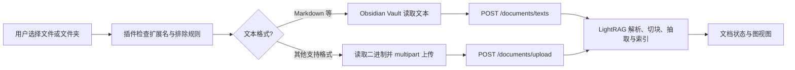

# 01｜Neural Composer 的实际实现

## 1. 职责分工

| 层 | 实际职责 | 证据 |
|---|---|---|
| Obsidian 插件 | 文件/文件夹操作、监视文件变更、状态点、聊天与图视图、设置及服务进程管理 | [README](https://github.com/oscampo/obsidian-neural-composer#features)、[`main.ts`](https://github.com/oscampo/obsidian-neural-composer/blob/main/src/main.ts)、[`docIndexService.ts`](https://github.com/oscampo/obsidian-neural-composer/blob/main/src/core/rag/docIndexService.ts) |
| 插件中的 RAG 适配器 | 上传文本/文件、请求 `/query`、把返回的答案和引用转成聊天结果 | [`ragEngine.ts`](https://github.com/oscampo/obsidian-neural-composer/blob/main/src/core/rag/ragEngine.ts) |
| LightRAG Python 服务 | 解析与切块、抽取实体和关系、维护图和向量、执行查询与生成 | [官方仓库](https://github.com/HKUDS/LightRAG)、[论文 §3](https://arxiv.org/html/2410.05779v3) |

因此“插件使用 LightRAG”具体是 **HTTP 客户端 + 可选的本地服务管理**，不是一个纯 TypeScript 的图检索实现。官方安装要求先安装 `lightrag-hku[api]`；本地模式由插件启动配置好的命令，移动端使用远端 LightRAG 服务。证据：[插件 README 安装与移动端说明](https://github.com/oscampo/obsidian-neural-composer#readme)。

## 2. 笔记进入索引的路径

`ingestFile()` 对 `md/txt/csv/json/html/htm/xml` 读取文本；Markdown 前加文件标题，然后调用 `insertDocument()`，请求体包含 `texts` 与 `file_sources`。其他支持格式调用 `uploadDocument()`，把文件作为 multipart 发送给 `/documents/upload`。路径和文件名用于来源定位。见 [`ragEngine.ts` 的 `ingestFile`、`insertDocument`、`uploadDocument`](https://github.com/oscampo/obsidian-neural-composer/blob/main/src/core/rag/ragEngine.ts)。

插件在文件夹右键菜单注册摄入动作；对配置的监视文件夹监听 create/delete/rename/modify。modify 使用约 5 秒防抖，更新时先删除旧文档再重新摄入；处理状态由单独服务记录和轮询。这里的“增量”是**按文件重送**，不是插件自己对文本块做精细 diff。见 [`main.ts` 文件事件处理](https://github.com/oscampo/obsidian-neural-composer/blob/main/src/main.ts)、[`ragEngine.ts` 的 `reindexFile`](https://github.com/oscampo/obsidian-neural-composer/blob/main/src/core/rag/ragEngine.ts)。LightRAG 服务再把新文档合入它的索引；不应把这两个粒度混为一谈。

## 3. 提问时有两条路径

| 输入情形 | `processQuery()` 的行为 | 后果 |
|---|---|---|
| `scope.files` 非空 | 直接用 Obsidian API 读取指定文件全文，返回 `local-file` 结果 | 这里绕过 LightRAG 图检索；也没有在该函数里对全文做相关段落选择。 |
| 未指定具体文件 | `POST /query`，提交问题、配置的 `mode`（缺省回退 `mix`）、`include_references: true` | 图/向量检索及答案生成在 LightRAG 服务内发生。 |

源码的请求体只含 `query/mode/stream/only_need_context/include_references`；`scope.folders` 虽在入参类型中，但该函数没有将其作为 LightRAG 查询过滤条件提交。因此不要根据 UI 中的“文件夹”字样推断任意问答都具备严格的服务端文件夹过滤。证据：[插件 `processQuery()`](https://github.com/oscampo/obsidian-neural-composer/blob/main/src/core/rag/ragEngine.ts)。

`/query` 返回 `response` 与 `references` 后，插件把生成的答案放在 `Graph's memory` 项中，并为各引用建立可点击来源。显示的 `similarity` 由**答案里 `[N]` 被引用的次数**换算：引用至少一次时为 `0.40 + 0.55 × (该引用次数 / 最大引用次数)`，未引用但列在 `references` 中为 `0.20`。这是展示层启发式分数，**不是 LightRAG 返回的向量相似度，也不是校准过的相关概率**。证据：[`ragEngine.ts` 的引用处理](https://github.com/oscampo/obsidian-neural-composer/blob/main/src/core/rag/ragEngine.ts)。

## 4. 设置、隐私与运行代价

- 社区页面和 README 列出本地 Ollama、托管模型、远端 LightRAG、重排、自定义实体类型、2D/3D 图和 MCP 接口。使用托管模型时，摄入文本和查询会走所配置的提供商；“100% 本地”只适用于本地 LightRAG + 本地模型的配置。[README 隐私说明](https://github.com/oscampo/obsidian-neural-composer#privacy--security)
- 本地服务需要 Python、安装 LightRAG、工作目录与进程管理；其 README 说明会使用 `fs`、`child_process`，并可写入用户选择的 Vault 外工作目录。移动端依赖远端服务。[README 系统权限说明](https://github.com/oscampo/obsidian-neural-composer#system-level-access-disclosures)
- 这些是 Neural Composer 的实现选择，不能直接视为 Vault Coach 的既有能力或适合移植的默认值。Vault Coach 的插件规范要求尽量只在 Vault 内读写、默认离线及明确披露外部传输。
