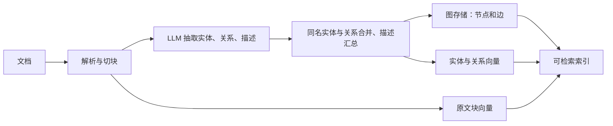

# 02｜LightRAG 原理与检索路径

## 1. 要解决的问题

普通向量 RAG 把文档切成块后按相似度选块。跨文档关系问题可能需要把多个块中的实体与关系串起来；单个块的相似度并不能保证这条证据链完整。LightRAG 在文本块之外建立**实体—关系图**，查询时既找具体实体，也找主题关系，再追溯原文。这里的优势是可检验的设计假设，不代表每个 Vault 或每类问题都优于简单检索。[LightRAG 论文 §1、§3](https://arxiv.org/html/2410.05779v3)

## 2. 建索引：从文本到图

论文的抽象步骤是 `Recog → Prof → Dedupe`：先从块中识别实体与关系，再为节点和边形成可检索的名称/主题词及描述，最后合并重复项。原文块仍保留以支持溯源。新文档走同一抽取流程并合入已有图，无需每次全量重建；删除或改写涉及旧证据清理，需以当前服务实现核对。证据：[论文 §3.1](https://arxiv.org/html/2410.05779v3)、[现行 LightRAG 文档处理说明](https://github.com/HKUDS/LightRAG/blob/main/docs/FileProcessingPipeline.md)。

**注意成本位置**：图不是免费得到的。每个待抽取块可能触发模型调用，合并和描述更新也有成本；解析质量、抽取模型与实体规范化直接决定图的可用性。LightRAG 官方也提示，改变 embedding 模型通常要重做块、实体、关系的向量。[论文 §3.4](https://arxiv.org/html/2410.05779v3)、[官方 embedding 说明](https://github.com/HKUDS/LightRAG#embedding-models)

### 对照现行源码阅读

| 入口 | 可以核查什么 |
|---|---|
| [`lightrag/lightrag.py`](https://github.com/HKUDS/LightRAG/blob/main/lightrag/lightrag.py) | `LightRAG` 类、文档处理与查询编排、存储后端注入。 |
| [`lightrag/operate.py`](https://github.com/HKUDS/LightRAG/blob/main/lightrag/operate.py) | 实体/关系抽取结果解析、合并时描述汇总、检索操作。代码中 `_process_json_extraction_result` 保留 chunk ID 与文件路径用于追溯，`_handle_entity_relation_summary` 在描述累积时执行有界汇总。 |
| [`lightrag/api`](https://github.com/HKUDS/LightRAG/tree/main/lightrag/api) | Neural Composer 调用的 HTTP 服务入口、文档和查询路由。 |
| [文件处理流水线文档](https://github.com/HKUDS/LightRAG/blob/main/docs/FileProcessingPipeline.md) | 多格式解析、文档状态、来源路径与重处理语义。 |

当前服务把存储分为 KV（原文/缓存/抽取结果）、向量（块、实体、关系）、图和文档状态四类。官方说明默认实现主要驻留内存并落本地文件，适合小规模测试；较大部署需按实际 RAM 与服务目标选择后端。这解释了为何“能索引”与“适合大规模生产运行”不是同一承诺。[官方存储说明](https://github.com/HKUDS/LightRAG#selecting-backend-storage)

## 3. 查索引：具体事实与跨文档主题

论文的“双层”指查询时把问题拆成**局部关键词**（具体实体、事实）和**全局关键词**（主题、关系）：局部词召回实体，全局词召回关系；再补邻居节点、关系描述和关联原文，送给生成模型。论文中的 `local/global` 指知识粒度，和 Neural Composer 对“指定文件直接读取”的 `local-file` 路径不是同一概念。[论文 §3.2–3.3](https://arxiv.org/html/2410.05779v3)

| LightRAG 查询模式 | 主要候选 | 适合的问题 | 典型风险 |
|---|---|---|---|
| `naive` | 原文块向量 | 原句附近的局部事实、基线比较 | 跨块关系可能断裂。 |
| `local` | 实体及局部关联 | 指定概念、人物、方法的细节 | 实体未抽出或别名不一致会漏召回。 |
| `global` | 关系及主题线索 | 跨文档主题、依赖、趋势 | 关系描述若含混，会引入噪声。 |
| `hybrid` | `local + global` | 同时需要事实与关系 | 上下文变多，需排序和预算。 |
| `mix` | `local + global + naive` | 混合问题、希望保留原文块兜底 | 可能更慢，候选冗余也更多。 |

上述五种模式及 `mix` 当前默认值来自 [LightRAG 官方查询模式说明](https://github.com/HKUDS/LightRAG#selecting-query-modes)；它是当前工程接口的描述，论文重点是双层图检索。Neural Composer 的 `POST /query` 会传设置中的模式，未设置时回退 `mix`。[插件请求源码](https://github.com/oscampo/obsidian-neural-composer/blob/main/src/core/rag/ragEngine.ts)

## 4. 为什么图能改善某些检索

例：三个笔记分别写“方法 A 依赖概念 B”“B 的前置条件是 C”“C 的实验失败”。问“为什么 A 的实验失败”时，单个块可能只命中 A；图能从 A 相关实体出发补 B、C 的关系及证据。答案仍应引用包含关系的原文块；图边若由模型错误抽取，路径越长越容易放大错误。这个例子是机制演示，不是 Neural Composer 的实测样例。

LightRAG 的查询并非只靠图遍历：查询关键词与实体/关系向量匹配负责找到入口，图邻域负责补结构，原文块负责可引用事实，最后由 LLM 生成答案。`mix` 还把普通块向量检索合入。[论文 §3.2–3.3](https://arxiv.org/html/2410.05779v3)、[官方查询模式说明](https://github.com/HKUDS/LightRAG#selecting-query-modes)

工程实现还要限制“召回多少”：官方提供实体、关系和总上下文 token 预算。若图候选占满预算，原文证据会减少；若原文块太多，关系链又可能被挤掉。因此评估应同时看答案和最终进入 prompt 的三类上下文，而非只看候选池。[官方查询预算配置](https://github.com/HKUDS/LightRAG#other-important-configurations-for-document-querying)

## 5. 论文结论的适用范围

论文在选定文本数据集与任务上报告了优于若干基线的结果；它**没有**证明所有 Obsidian Vault、所有语言/模型/硬件组合均更快或更准。现行 LightRAG 还加入重排、多解析器和并发设置，不能把这些新特性产生的效果归因于原论文。判断是否适合 Vault Coach，应在同一批查询、同一来源范围和预算下，与现有 keyword/vector/hybrid 做配对评估。[论文实验设置](https://arxiv.org/html/2410.05779v3)、[LightRAG 当前 README](https://github.com/HKUDS/LightRAG#readme)
