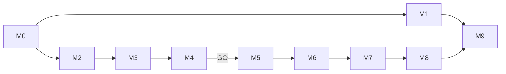

---
tags:
  - VaultCoach
  - v1.5
  - 开发规划
  - 学习路线
status: planned
updated: 2026-10-09
product-theme: Zero-Setup Semantic Search
source:
  - ../../产品更新/v1.5 产品层优化.md
  - ../../VaultCoach-当前详细架构总览.md
---

# Vault Coach 1.5 开发总览与学习路线

## 1. 版本目标

Vault Coach 1.5 的目标不是增加另一种 RAG 算法，而是降低首次成功成本：

```text
选择知识范围 + 配置一个聊天 LLM
                ↓
         自动准备语义检索
                ↓
       Ask / Test / Review / Improve
```

默认用户不需要理解 embedding、chunk、TopK、RRF 或 rerank。高级用户仍可在 Advanced 中调整这些参数。

### 1.1 成功条件

1. 新用户能从首次打开完成知识范围和聊天模型设置，并得到第一个带来源回答或生成第一次考试；
2. 默认语义检索不要求单独安装 embedding 服务；
3. 内置 embedding 不阻塞 Obsidian UI，失败时 keyword 仍可用；
4. 旧用户升级时不静默下载大模型、不混用新旧向量、不丢失 Assessment 或治理决策；
5. Desktop 和 Mobile 的能力差异被明确检测、展示和测试；
6. CI 可以复现 lint、test、build、版本一致性和 release artifact 检查；
7. 版本发布证据可审计，宣传文案描述用户结果而非未验证的技术优势。

### 1.2 不以这些指标代替成功

- main.js 能构建，不等于 Worker、WASM 和模型在 Obsidian 中可运行；
- benchmark 分数高，不等于首次下载、内存和移动端体验可接受；
- fallback 到 keyword，不等于内置 embedding 成功；
- README 更新，不等于 Marketplace metadata 已同步；
- GitHub Action 绿灯，不等于 release assets 可被 Obsidian 安装。

## 2. 为什么调整产品文档中的开发顺序

产品文档把 benchmark 放在内置 embedding 接入之后。工程上应提前建立技术闸门：先抽象 provider，再用最小原型验证模型质量、WASM/Worker 打包、缓存和移动端可行性。只有闸门通过，才把内置 provider 设为新安装默认值。

调整后的顺序：

| 顺序  | 里程碑                                                      | 主要交付                                     | 核心技能                     |
| --- | -------------------------------------------------------- | ---------------------------------------- | ------------------------ |
| M0  | [[里程碑0-基线冻结与产品契约\|基线冻结与产品契约]]                            | 可复现基线、指标、风险清单、分支策略                       | 需求拆解、Git、调试基线            |
| M1  | [[里程碑1-产品定位与发现入口\|产品定位与发现入口]]                            | Marketplace description、README 故事、词汇表    | 产品文案、发布元数据               |
| M2  | [[里程碑2-默认体验与Advanced设置分层\|默认体验与 Advanced 设置]]            | Auto 检索、隐藏专家参数、设置模块化                     | UI 状态、兼容设置迁移             |
| M3  | [[里程碑3-EmbeddingProvider解耦与索引指纹\|Embedding Provider 解耦]] | 窄接口、provider router、fingerprint v2       | SOLID、依赖注入、迁移            |
| M4  | [[里程碑4-内置Embedding技术验证与多语言基准\|技术验证与多语言基准]]               | 候选模型报告、打包/缓存/移动端 ADR                     | Benchmark、profiling、ADR  |
| M5  | [[里程碑5-内置Embedding运行时与模型缓存\|内置 Embedding 与缓存]]           | Transformers.js provider、显式下载、清缓存        | WASM/WebGPU、缓存、隐私        |
| M6  | [[里程碑6-Worker化与可观测索引进度\|Worker 与可观测索引]]                  | inline worker、取消、真实进度、无主线程长任务            | 并发、消息协议、性能调试             |
| M7  | [[里程碑7-首次启动SetupWizard与首个成功动作\|Setup Wizard]]            | Knowledge → LLM → Prepare → First Action | 状态机、可恢复流程、UX 测试          |
| M8  | [[里程碑8-迁移兼容与跨平台加固\|迁移与跨平台加固]]                            | 新旧用户迁移、离线/移动端/故障矩阵                       | 兼容性、故障注入、回归              |
| M9  | [[里程碑9-CICD发布与持续更新\|CI/CD 与 1.5 发布]]                     | 版本门禁、Release、安装验证、持续更新材料                 | GitHub Actions、SemVer、回滚 |

依赖关系：



M4 是明确的 GO/NO-GO 闸门。NO-GO 不是失败；它意味着证据不足以把内置 embedding 设为默认，需要缩小模型、改变缓存/打包方案或推迟该能力。

## 3. 跨里程碑架构约束

1. `AdvancedRagEngine` 只消费 embedding port，不判断 builtin/Ollama/OpenAI；
2. 聊天 LLM 与 embedding provider 是两个独立能力；
3. 内置模型首次下载必须由用户可见动作触发，显示来源、大小、进度和取消；
4. model ID、revision、dtype、dimension、pooling、normalization 和实现版本共同参与 fingerprint；
5. corpus embedding 与 query embedding 必须来自相同 fingerprint；
6. Worker 通过有版本的消息协议通信，结果用 transferable buffer 返回；
7. WebGPU 是优化路径，WASM 是兼容路径；WebGPU 失败必须可回退；
8. 内置模型失败时允许 keyword，不自动把文本发送给另一个外部 embedding 服务；
9. 新安装默认 builtin；旧安装保留既有 provider，直到用户选择迁移；
10. Setup Wizard 是 Application/UI 用例，不直接读写 JSON 或构造 Service；
11. Progress 必须来自真实阶段和计数，不能用循环动画伪造百分比；
12. 任何网络、缓存、模型和平台假设都要有测试或手工验证证据。

## 4. 每个里程碑的统一工作方法

### 4.1 开始前

```bash
git status --short
git switch -c feature/v1.5-mN-short-name
npm ci
npm run lint
npm test
npm run build
```

记录当前 commit、Node 版本、Obsidian 版本、测试数和已知未提交文件。不要在脏工作区里把无关修改混进里程碑。

### 4.2 推荐提交节奏

1. `test:` 先增加失败测试或 fixture；
2. `refactor:` 建立接口/接缝，不改变用户行为；
3. `feat:` 实现最小可见能力；
4. `fix:` 处理故障注入发现的问题；
5. `docs:` 更新架构、README 和开发记录。

每次提交只表达一个可解释变化。练习 `git diff --check`、`git show --stat`、`git bisect` 和从干净 checkout 复现问题。

### 4.3 完成证据

每个里程碑至少保存：

- 实现前后的数据流图；
- 受影响文件清单及原因；
- 自动测试命令与结果；
- 手工验证步骤、平台、截图或录屏；
- 一次主动故障注入及观察结果；
- 性能或体积变化；
- 未解决风险和下一里程碑输入；
- 回滚方式。

## 5. 调试训练主线

| 阶段 | 必练工具/方法 |
| --- | --- |
| M0–M2 | `git diff`、Vitest 单测筛选、Obsidian Developer Console、状态机日志 |
| M3–M4 | contract tests、golden fixtures、benchmark、CPU/内存 profile |
| M5–M6 | Network panel、Cache API inspection、Worker DevTools、performance long tasks |
| M7–M8 | 故障注入、断网、缓存损坏、升级迁移、移动端远程调试 |
| M9 | GitHub Actions 日志、artifact 校验、tag/release 回滚、干净 Vault 安装 |

日志应记录 request/job ID、阶段、数量、耗时、provider fingerprint 和错误代码。不得记录 API key、完整笔记文本、用户问题或模型输出正文。

## 6. CI/CD 学习主线

1. PR CI：Node 20/22 下安装、type/build、lint、unit/integration tests；
2. 可重复构建：固定 lockfile，避免运行时拉取远程 JavaScript；
3. 版本门禁：package、manifest、versions、tag 必须一致；
4. Release job 在发布前重新跑验证，不直接信任另一个 workflow 的结果；
5. release asset 单独检查 `main.js`、`manifest.json`、`styles.css`；
6. 用干净 Vault 做安装 smoke test；
7. benchmark 和真实模型下载不进入普通 PR CI，使用手工 workflow 或有缓存的受控 job；
8. 发布后验证 Obsidian 能按 tag 找到相同版本资产。

## 7. 官方技术依据

- Transformers.js 当前稳定文档说明浏览器默认使用 WASM，可选择 WebGPU，并支持量化 dtype；实现时必须固定实际 npm 版本与 lockfile：<https://huggingface.co/docs/transformers.js/en/index>
- pipeline 支持模型 revision 和首次下载后的浏览器缓存：<https://huggingface.co/docs/transformers.js/pipelines>
- `env` 支持 browser cache、custom cache、remote/local model 控制：<https://huggingface.co/docs/transformers.js/api/env>
- `progress_callback` 提供文件和总字节进度：<https://huggingface.co/docs/transformers.js/api/utils/core>
- Obsidian Mobile 不提供 Node.js/Electron API：<https://docs.obsidian.md/Plugins/Getting%20started/Mobile%20development>
- Marketplace 使用 name、author、description 搜索，并从 release 下载 `main.js`、`manifest.json`、`styles.css`：<https://github.com/obsidianmd/obsidian-releases>

## 8. 文档维护规则

完成一个里程碑后，将对应文件 frontmatter 的 `status` 改为 `implementation-complete` 或 `blocked-with-evidence`，补充实际 commit、测试结果和偏差。不要删除原计划；在“实施记录”中说明为何改变。

最终发布前同步更新：

- `../../VaultCoach-当前详细架构总览.md`；
- `README.md`、`README_CN.md`；
- `manifest.json`、`versions.json`；
- v1.5 Release notes；
- 本目录 M9 的发布证据。
